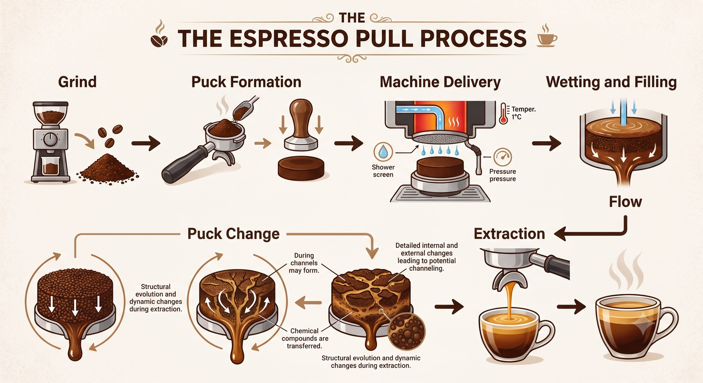

<!-- Landing page. The design authority is docs/PUBLIC_EXPERIENCE.md — edit that first.
     The project-pulse block is generated: `python tools/update_readme_pulse.py --write`. -->

<p align="center">
  
</p>

# puckworks

<p align="center">
  <a href="https://github.com/trbrewer/puckworks/actions/workflows/gates.yml"></a>
  <a href="https://github.com/trbrewer/puckworks/releases/latest"></a>
  
  <a href="LICENSE"></a>
</p>

**Physics-based models for the espresso pull — from grind and puck structure to water flow, puck
change, and extraction.**

Puckworks is an open-source research toolkit for understanding how an espresso shot develops. It
brings together published models of particle size, puck structure, water entering and moving through
porous coffee, changes inside the puck during the shot, and the release of soluble material into the
cup.

Rather than forcing every paper into one all-purpose model, Puckworks keeps each physical model as a
separate, testable module. This lets researchers compare alternative explanations, see the conditions
where each model applies, and check predictions against the measurements that are actually available.

<p align="center">
  <a href="https://colab.research.google.com/github/trbrewer/puckworks/blob/main/notebooks/puckworks_quickstart_colab.ipynb"></a>
</p>

**Try it now:**
[▶ Run the quickstart in Google Colab](https://colab.research.google.com/github/trbrewer/puckworks/blob/main/notebooks/puckworks_quickstart_colab.ipynb)
 · [⬇ Download the latest public release](https://github.com/trbrewer/puckworks/releases/latest)
 · [🔬 Explore the evidence](docs/public/README.md)
 · [📊 View current project status](docs/planning/STATE_OF_TRUTH.md)
 · [🧭 Learn the architecture](docs/ONBOARDING.md)
 · [🛠 Contribute a model or dataset](CONTRIBUTING.md)

> **New session (human or agent)? Start with [docs/ONBOARDING.md](docs/ONBOARDING.md).**

---

## The espresso pull, modeled stage by stage

An espresso shot is a chain of physical steps:

<p align="center">
  
</p>

This is a *conceptual* sequence to organize the models. In a real shot the stages overlap and interact
— water is still wetting deeper layers while the top is already extracting, and the puck keeps changing
throughout.

| Stage | The physical question |
|---|---|
| Grind | How does the grinder setting set particle size and the spread of sizes? |
| Puck formation | How do particle size, shape, packing, and void space set the porous structure? |
| Machine delivery | How do the pump, tubing, trapped air, and puck resistance set pressure and flow? |
| Wetting and filling | How quickly does water invade the initially dry pore space? |
| Flow | How do permeability, viscosity, unevenness, and inertia route water through the puck? |
| Puck change | How do swelling, compaction, fines movement, and dissolution change resistance mid-shot? |
| Extraction | How do soluble compounds leave the particles and travel out with the liquid? |

**Library versus Guided Pull.** Puckworks contains many models that examine different stages or offer
competing explanations. It does **not** fuse them into one consensus simulation. The runnable *Guided
Pull* executes one coherent primary model chain (currently the `cameron2020.extraction_bdf` extraction
model, which internally spans grind → flow → extraction → cup); every other model is available
separately — as an alternative model, a calibration or comparison relationship, a pore-scale reference
solver, an exploratory synthesis, or a source-data constraint. The roles below say which is which.

<!-- puckworks-model-map:start -->

**25 registered models**, in one table so the columns line up, ordered by the stage they address. Names are the exact identifiers used in the code; each links to its model card (the source of truth for that model's physics, assumptions, and limits). "Runs in Guided Pull" marks the one model chain the public product executes.

| Stage | Model module | Role | What physics it represents |
|---|---|---|---|
| Grind | `wadsworth2026.grindmap` | Calibration / comparison | Maps a grinder dial to measured mean particle radius and size spread. Grinder-specific and **not portable** to other grinders. ([card](docs/cards/wadsworth2026_grindmap.md)) |
| Puck formation | `wadsworth2026.permeability` | Calibration / comparison | Permeability from particle size, porosity, and grain angularity. Validated untamped; the tamped range is an extrapolation. ([card](docs/cards/wadsworth2026.md)) |
| Puck formation | `brewer2026.pack_generator` | Pore-scale reference | Builds synthetic overlapping-sphere pucks with controlled heterogeneity for pore-scale flow experiments (a Puckworks model). ([models](puckworks/models/brewer2026/)) |
| Machine delivery | `foster2025.machine_mode` | Executable model (separate) | Couples pump behavior, pipe resistance, trapped-air headspace, and puck filling to predict delivered pressure and flow. Fine grind; nominal pump. ([card](docs/cards/foster2025_2.md)) |
| Machine delivery | `sourcing2026.g3_pump_characteristic` | Source-data constraint | Bounds the pump pressure–flow envelope from manufacturer endpoints and community curves. Endpoints are reference-strength; the curve shape is qualitative. ([card](docs/cards/g3_pump_characteristic.md)) |
| Wetting | `foster2025.infiltration` | Executable model (separate) | Tracks a sharp water front advancing through an initially dry puck under a measured or prescribed pressure history. Validated against CT, fine grind. ([card](docs/cards/foster2025.md)) |
| Wetting | `sourcing2026.g1_glassbead_analog` | Source-data constraint | Uses glass-bead retention and relative-permeability measurements as a *shape* prior for wetting. This is an analogy, **not** coffee-specific validation of absolute values. ([card](docs/cards/g1_glassbead_analog.md)) |
| Flow | `brewer2026.lb_reference` | Pore-scale reference solver | Resolves low-Reynolds pore flow with a D3Q19 two-relaxation-time lattice-Boltzmann solver (verification twin; a Puckworks model). ([models](puckworks/models/brewer2026/)) |
| Flow | `brewer2026.lb_taichi` | Pore-scale reference solver | Accelerated (CPU/GPU) build of the same pore-scale flow physics; the `taichi` dependency is optional, so it is not run by default. ([models](puckworks/models/brewer2026/)) |
| Flow | `lee2023.feedback` | Calibration / comparison | Competing flow paths in which extraction changes porosity and permeability, redistributing water. A qualitative fine-grind-dip hypothesis only — the decline needs an unphysical density. ([card](docs/cards/lee2023.md)) |
| Flow | `wadsworth2026.inertial` | Executable supporting model | Adds a Forchheimer inertial-resistance correction where Darcy's linear pressure–flow law starts to fail. A regime flag; the fitted constant is extrapolated for tamped coffee. ([card](docs/cards/wadsworth2026_inertial.md)) |
| Flow | `sourcing2026.g10_liquor_rheology` | Source-data constraint | Supplies coffee-liquid viscosity and density versus temperature and concentration for flow-resistance studies. Measured on soluble-coffee extract and extrapolated to espresso; the bulk-cup effect is near-negligible. ([card](docs/cards/g10_liquor_rheology.md)) |
| Puck change | `brewer2026.streamtube` | Executable model (separate) | Uneven flow through parallel, non-exchanging paths whose permeability follows a statistical distribution. Calibrated at low dials; interpolated, not externally validated (a Puckworks model). ([models](puckworks/models/brewer2026/)) |
| Puck change | `brewer2026.coupled_kappa_t` | Exploratory synthesis | Explores how swelling, compaction, fines movement, and extraction-driven porosity change might combine into a time-varying puck resistance. A framework only — as sound as its shakiest donor branch. ([card](docs/cards/brewer2026_coupled_kappa_t.md)) |
| Puck change | `fasano2000_partI.fines_migration` | Calibration / comparison | Tracks mobile fines, deposition and release, compacted layers, and their effect on Darcy flow. A mechanism demonstration; the closures are ours, not the source paper's. ([card](docs/cards/fasano2000_partI.md)) |
| Puck change | `mo2023_2.swelling` | Executable model (separate) | Water entering particles, swelling, loss of pore space, and the resulting decline in permeability and flow. The fixed-pressure flow-decay ratio is reproduced; the swelling claim is unvalidated in the source. ([card](docs/cards/mo2023_2.md)) |
| Puck change | `waszkiewicz2025.poroelastic` | Executable model (separate) | Couples puck deformation, pressure, permeability, and dissolution-driven pore change in a saturated poroelastic bed. One rig and coffee; quantitative only above about 5 bar. ([card](docs/cards/waszkiewicz2025.md)) |
| Extraction | `cameron2020.extraction_bdf` | **Runs in Guided Pull** | One-dimensional saturated extraction with advection, in-particle diffusion, and nonlinear dissolution from fine and coarse particle families. EK43 dial 1.1–2.3; 20 g in / 40 g out class recipes. ([card](docs/cards/cameron2020.md)) |
| Extraction | `pannusch2024.solver` | Executable model (separate) | Extraction from fine and coarse particles with interphase mass transfer and temperature- and flow-dependent transport. 80–98 °C, 1–3 mL/s; the fitted Sherwood law lacks generality. ([card](docs/cards/pannusch2024.md)) |
| Extraction | `pannusch2024.closures` | Calibration / comparison | Supplies diffusivity, viscosity, density, Sherwood-number, temperature, and equilibrium relationships used by the pannusch extraction model. ([card](docs/cards/pannusch2024.md)) |
| Extraction | `grudeva2025.reduced` | Executable model (separate) | A reduced asymptotic extraction model with a moving wetting front and fine/coarse particle families. Saturated-fines regime; prescribed flow; verification-gated. ([card](docs/cards/grudeva2025.md)) |
| Extraction | `liang2021.desorption` | Calibration / comparison | An immersion-derived equilibrium extraction ceiling and retained-liquid correction. **Not** itself a flowing-puck model — it supplies a ceiling and a kernel. ([card](docs/cards/liang2021.md)) |
| Extraction | `moroney2016.surrogate` | Calibration / comparison | A reduced constant-pressure extraction model that captures early release, a plateau, and later wash-through. Qualitative reproduction of the source figure. ([card](docs/cards/moroney2016.md)) |
| Extraction | `mo2023_2.coupled_bed` | Executable model (separate) | Extraction resolved by bed depth using fine/coarse diffusion, partitioning, and a moving filling front under fixed flow. Type-M, cup mass below ~30 g; absolute yield needs one inventory scale. ([card](docs/cards/mo2023_2.md)) |
| Extraction | `romancorrochano2017.extraction` | Executable model (separate) | Molecular-size-dependent diffusion from spherical coffee grains with partitioning between solid and liquid. Solver verified against the analytic solution; supplies a flow *trend*, not absolute yield. ([card](docs/cards/romancorrochano2017_extraction.md)) |

None of these models is coupled to the others into a single simulation. Each runs, or constrains, its
own stage; the Guided Pull executes only the Cameron extraction chain above.
<!-- puckworks-model-map:end -->

## What you can run today

Three public paths (no local setup required):

- **Explore the component registry** — [▶ Open the quickstart in Google Colab](https://colab.research.google.com/github/trbrewer/puckworks/blob/main/notebooks/puckworks_quickstart_colab.ipynb): list the models, read each one's source and the conditions where it applies, and run the automated scientific checks. It installs the latest released wheel after verifying its SHA-256.
- **Run a guided espresso pull** — [▶ Open the Guided Espresso Pull in Google Colab](https://colab.research.google.com/github/trbrewer/puckworks/blob/main/notebooks/guided_espresso_pull_colab.ipynb): enter a bounded recipe and run one coherent, model-backed pull stage by stage, with evidence-labelled traces and honest range warnings. You supply the dose, beverage mass, grinder dial, and pressure; the `cameron2020.extraction_bdf` model runs; you get extraction-yield, strength, flow, and a stage-by-stage report. It reports chemical composition, **not** taste; it does **not** model puck wetting, physical first drip, a dynamic pressure profile, temperature response, or flavor. See [`docs/GUIDED_ESPRESSO_PULL.md`](docs/GUIDED_ESPRESSO_PULL.md) and [issue #48](https://github.com/trbrewer/puckworks/issues/48).
- **Explore why the cup hides the clock** — [▶ Open the flat-valley interactive](https://trbrewer.github.io/puckworks/flat-valley/): a static, generated explainer of why a good whole-cup endpoint fit can still hide weak parameter identification. Every number is generated from a committed result bundle; no install needed.

Specialists: the advanced GPU / lattice-Boltzmann notebook remains at
[`notebooks/espresso_lb_colab.ipynb`](notebooks/espresso_lb_colab.ipynb).

## Data used to check the models

Puckworks uses published measurements to set model inputs, reproduce reported results, and test whether
a model predicts observations it was not fitted to. These are different levels of evidence: an
independent measurement is a stronger test than reproducing a curve that was used to tune the model.
Every dataset and its evidence level is recorded, one row per artifact, in
[`puckworks/data/MANIFEST.csv`](puckworks/data/MANIFEST.csv).

<!-- puckworks-data-inventory:start -->

| Dataset or source family | What the data contains | How Puckworks uses it | Evidence level |
|---|---|---|---|
| Poroelastic flow rig (Waszkiewicz 2025) | 9-bar flow traces, TDS fractions, particle-size distribution, rig constants | Checks the poroelastic bed model and the pump→basket adapter; PSD reference | Independent within-rig; part post-fit reconstruction |
| Grind and permeability (Wadsworth 2026) | Measured mean particle radius, size spread, and untamped Darcy permeability | Sets the grind map and the permeability relationship | Independent measurement |
| Extraction kinetics (Schmieder 2023) | Timed extraction fractions, cup masses, fitted kinetic parameters | Reproduces multi-species extraction kinetics; drives the pannusch closures | Post-fit reconstruction; raw fractions independent |
| Kinetic closures and control chart (Pannusch 2024) | Fitted Sherwood parameters and experimental kinetics (public Mendeley set) | Sets and checks the pannusch extraction closures and solver | Post-fit reconstruction |
| CT infiltration and machine mode (Foster 2025) | Time-resolved micro-CT wetting fronts, headspace, and flow curves | Checks the infiltration front and the machine-mode delivery model | Independent (CT data) / verification of fitted curves |
| Immersion desorption (Liang 2021) | Full-immersion strength/extraction-yield and oven-dry retention | Sets the equilibrium extraction ceiling and retained-liquid kernel | Post-fit reconstruction; retention independent |
| Asymptotic surrogate (Moroney 2016) | Model parameters and a published exit-concentration curve | Reproduces the surrogate extraction model's plateau and wash-through | Reference set / qualitative |
| Reduced multiscale model (Grudeva 2026) | Two named configurations and per-vial extracted masses | Checks the reduced asymptotic extraction model | Reference set / post-fit reconstruction |
| Microstructural diffusion and permeability (Roman-Corrochano 2017) | Measured effective diffusivity, partition, hindrance, and tamped permeability | Sets diffusion in grains and a tamped-bed permeability target | Independent measurement; partition post-fit |
| Microstructure and swelling (Mo 2023) | Micro-CT / SPH flow and granulometry, and a fixed-pressure flow-decay curve | Checks the inertial-flow overlay and the swelling / coupled-bed models | Independent (SPH-derived) / verification |
| Multi-species independent validation (Angeloni 2023) | Caffeine, trigonelline, total solids, lipids, and roast-and-ground inventories | An out-of-fit test on a different machine, coffee, and basket | Independent measurement |
| Fines migration (Fasano 2000; Ellero 2019) | Digitized fines-transport figures and SPH discharge curves | Demonstrates the fines-migration mechanism and its reversal signature | Qualitative / verification of model output |
| Coffee-liquid rheology (Telis-Romero 2000, 2001; Khomyakov 2020) | Viscosity, density, and thermal properties of coffee extract vs temperature and concentration | Supplies the liquid-property closures for flow-resistance studies | Source-curve reproduction / reference |
| Reference inputs and engineering constraints | Pump P–Q endpoints, glass-bead retention, basket geometry (Schulman 2011; McKeon Aloe 2022), swelling anchors (Hargarten 2020), roasted composition (Bruno 2026), edge/center yield (Pocket Science 2024), an EY/TDS bracket (Egidi 2024) | Provide physical properties, boundary conditions, and coarse validation brackets rather than validating a whole model | Reference / qualitative |

Not shown here: one machine-logged hydraulic population source is used under permission and is **not
redistributed** (see [`puckworks/data/MANIFEST.csv`](puckworks/data/MANIFEST.csv) for its access
terms). "Independent" above means data not used to tune the model; "post-fit reconstruction" means the
comparison uses data that helped set the parameters; "verification" means the code reproduces an
equation, table, or published curve; and "reference" data supply a property or boundary condition
rather than validating the whole model.

<!-- puckworks-data-inventory:end -->

## How Puckworks checks its work

Each model keeps a visible connection to the paper, dataset, assumptions, units, and conditions it came
from. Automated scientific checks then compare each implementation with equations, published curves, or
independent measurements wherever those exist.

A few precise terms, defined in plain language:

- The model **catalog** is called the *registry* in the code (`puckworks/registry.py`).
- The checked data handoffs between stages are typed **interfaces**, called *contracts* in the code
  (`puckworks/contracts.py`) — strict SI units, validated inputs and outputs.
- Where a model or number came from is stored as its **source history**, called *provenance*.
- Each model records the **conditions where it applies** — its *validity range*.

In the code these automated checks are **validation gates**. Each reports **PASS**, **FAIL**, **SKIP**,
**ERROR**, or **ACKNOWLEDGED_EXCEPTION**: FAIL and ERROR make the suite fail, SKIP is never counted as a
pass, and an acknowledged exception is reported separately, never laundered into a pass. Every reported
number carries an origin label — **measured · derived · fitted · predicted · simulated** — or is marked
**unsupported**. Puckworks never upgrades one of these evidence labels.

<p align="center">
  
</p>

## The science, in depth

Two longer reads go beyond this landing page:

- **The public-value work** — [`docs/PUBLIC_VALUE.md`](docs/PUBLIC_VALUE.md) is the roadmap for turning
  Puckworks' data, model disagreements, and negative results into things a non-specialist coffee
  drinker can understand, check, and share. Its first interactive piece, *The Cup Hides the Clock*
  (linked under "What you can run today"), is already live; the generated, evidence-labelled claim
  cards that back these stories live in [`docs/public/README.md`](docs/public/README.md).
- **The paper behind the flat-valley result** — [`docs/submission/PAPER_A_JFE_MANUSCRIPT.md`](docs/submission/PAPER_A_JFE_MANUSCRIPT.md)
  is a **draft manuscript** (with a full abstract), *"Whole-cup measurements can obscure kinetic
  parameter localization in espresso extraction models."* It shows how a model can match the final
  cup while leaving the internal extraction rates weakly constrained — the technical write-up behind
  the interactive. It is a working draft, **not yet submitted or peer-reviewed**.

## Project pulse

<!-- puckworks-pulse:start -->

> Auto-generated from tracked repository state by `tools/update_readme_pulse.py` — inventory counts, not scientific claims. Regenerate with `--write`; CI fails if stale.

| Project pulse | |
|---|---|
| Latest public release | [`v0.3.0`](https://github.com/trbrewer/puckworks/releases/tag/v0.3.0) (`puckworks-0.3.0-py3-none-any.whl`; not on PyPI) |
| Development source | `0.4.0.dev0` (unreleased) |
| Registered components | 25 |
| Validation gates | 51 total — 50 PASS, 1 ACKNOWLEDGED_EXCEPTION (passed under the documented gate policy) |
| Active outcome | Guided Espresso Pull — v0.3.0 published; awaiting signed-out human Colab acceptance |
| Blocked outcomes | 3 (external sign-off / data) |
| Supported Python | 3.10–3.13 (3.12 primary/release interpreter) |

<!-- puckworks-pulse:end -->

*Development status and the latest public release are shown separately above — do not read the
development source as a released capability.*

## Install the public release

> **puckworks is not published on PyPI.** The canonical distributions are attached to the
> [latest GitHub Release](https://github.com/trbrewer/puckworks/releases/latest).

Download `puckworks-0.3.0-py3-none-any.whl` from the release, then:

```
python -m pip install puckworks-0.3.0-py3-none-any.whl
python -c "import puckworks; s = puckworks.evaluate_all_gates(); print(s.summary_text())"
python -c "import puckworks; print(len(puckworks.components()), 'models registered')"
```

The same pure-Python wheel is smoke-tested on **Windows, macOS, and Linux** under Python 3.12;
interpreter CI additionally exercises Python 3.10, 3.12, and 3.13. Per-platform commands and the
support matrix: [`docs/ACCESSIBILITY.md`](docs/ACCESSIBILITY.md).

The **supported public API** is exactly `puckworks.__all__`; selected commonly-used entry points from
it include `evaluate_all_gates`, `components`, `get`, `Component`, `contracts`, `validate`,
`load_builtin_components`, `GateStatus`, `GateResult`, and `GateSuiteResult`. See
[`docs/API.md`](docs/API.md) for the full surface and stability policy; everything else is internal
research tooling. (The Colab notebooks install the **v0.3.0** wheel — its API is v0.3.0's `__all__`,
which may differ from the unreleased main branch.)

Contributors / release builders: `python -m pip install -e ".[dev]"`; see
[`CONTRIBUTING.md`](CONTRIBUTING.md).

## Choose your path

- **Enthusiast / layperson** → [run the Colab quickstart](notebooks/puckworks_quickstart_colab.ipynb),
  then read *The espresso pull, modeled stage by stage* above.
- **Researcher** → start at [docs/ONBOARDING.md](docs/ONBOARDING.md), then the model cards in
  `docs/cards/` (the source of truth for each model's physics) and
  [current status](docs/planning/STATE_OF_TRUTH.md).
- **Contributor** → [CONTRIBUTING.md](CONTRIBUTING.md) and the card-first process; the public API is
  documented in [docs/API.md](docs/API.md).

## Current limits — what Puckworks deliberately does *not* claim

Puckworks is:

- **not** a universal mega-model, and its models are not fused into one coupled simulation;
- **not** an automatic channeling detector;
- **not** a flavor or taste predictor — it reports chemical composition, not sensory quality;
- **not** a universal recipe optimizer;
- **not** a replacement for controlled experiments;
- **not** a mechanism oracle.

The current Guided Pull begins from an **already-saturated** puck: it does not model dry-puck wetting or
physical first drip, holds temperature fixed (no thermal transient), prescribes a constant pressure, and
reports chemical composition rather than taste. Most extraction agreements in the underlying science are
*post-fit reconstruction*, not independent validation. The catalog surfaces conflicting constants and
per-lineage inventories side by side rather than merging them.

## Contribute

1. Write the **model card** from `docs/cards/TEMPLATE.md` (this is where papers get interrogated —
   before any code).
2. Implement under `puckworks/models/<key>/`, consuming and producing the typed interface (contract)
   types.
3. Register in `puckworks/models/__init__.py` with assumptions and the conditions where it applies.
4. Add at least one automated check wired to real data in `puckworks/data/`.

Details: [CONTRIBUTING.md](CONTRIBUTING.md), [docs/API.md](docs/API.md), and the doc index
[docs/CURRENT.md](docs/CURRENT.md).

## References

The models draw on the published work below. Where several model cards use the same source, one entry
lists the related cards. DOIs and stable links are included exactly as recorded in the cards; no
bibliographic field is invented.

<!-- puckworks-references:start -->

1. Angeloni, S.; Giacomini, J.; Maponi, P.; Perticarini, A.; Vittori, S.; Cognigni, L.; Fioretti, L. "Computer percolation models for espresso coffee: state of the art, results and future perspectives." *Applied Sciences* 13 (2023): 2688. [https://doi.org/10.3390/app13042688](https://doi.org/10.3390/app13042688). Related cards: [angeloni2023](docs/cards/angeloni2023.md).
2. Bruno, R.; Egidi, N.; Fatone, L.; Giacomini, J.; Maponi, P.; Sagratini, G.; Santanatoglia, A.; Trebović, S. "A preliminary model to establish a digital twin for coffee roasting." *Scientific Reports* 16 (2026): 15857. [https://doi.org/10.1038/s41598-026-43923-9](https://doi.org/10.1038/s41598-026-43923-9). Related cards: [bruno2026](docs/cards/bruno2026.md).
3. Cameron et al. "Systematically improving espresso." *Matter* 2 (2020): 631–648. [https://doi.org/10.1016/j.matt.2019.12.019](https://doi.org/10.1016/j.matt.2019.12.019). Related cards: [cameron2020](docs/cards/cameron2020.md).
4. Egidi, N.; Giacomini, J.; Larsson, E.; Perticarini, A. "An improved numerical scheme for coffee extraction yield evaluation." *Chaos, Solitons & Fractals* 188 (2024): 115625. [https://doi.org/10.1016/j.chaos.2024.115625](https://doi.org/10.1016/j.chaos.2024.115625). Related cards: [egidi2024](docs/cards/egidi2024.md).
5. Ellero, M.; Navarini, L. "Simulation of espresso coffee extraction using smoothed particle hydrodynamics." *Proc. PARTICLES 2019* (2019): 68–79. No stable external link is recorded in the model card. Related cards: [ellero2019](docs/cards/ellero2019.md).
6. Fasano, A.; Talamucci, F.; Petracco, M. "The espresso coffee problem." In *Complex Flows in Industrial Processes* (A. Fasano, ed.), 241–280. Springer, 2000. No DOI is recorded in the model card. Related cards: [fasano2000_partI](docs/cards/fasano2000_partI.md).
7. Foster, J.; Lee, W.; Moroney, K.; Prjamkov, D.; Salamon, M.; Smith, A.; Petrassem-de-Sousa, J.; Vynnycky, M. "Dynamics of liquid infiltration into an espresso bed using time-resolved micro-computed tomography: insights from experiment and modeling." *Physics of Fluids* 37 (2025): 013383. [https://doi.org/10.1063/5.0245167](https://doi.org/10.1063/5.0245167). Related cards: [foster2025](docs/cards/foster2025.md), [foster2025_2](docs/cards/foster2025_2.md).
8. Grudeva, Y. "Espresso brewing: mathematical modelling and experiment." PhD thesis, University of Portsmouth, 2023 (no DOI). And: Grudeva, Y.; Moroney, K.; Foster, J. "A multiscale model for espresso brewing: asymptotic analysis and numerical simulation." *European Journal of Applied Mathematics* 37 (2026): 496–519. [https://doi.org/10.1017/S095679252500018X](https://doi.org/10.1017/S095679252500018X). Related cards: [grudeva2025](docs/cards/grudeva2025.md).
9. Hargarten, V. B.; Kuhn, M.; Briesen, H. "Swelling properties of roasted coffee particles." *Journal of the Science of Food and Agriculture* 100(11) (2020). [https://doi.org/10.1002/jsfa.10440](https://doi.org/10.1002/jsfa.10440). Related cards: [hargarten2020](docs/cards/hargarten2020.md).
10. Khomyakov, A. P.; Mordanov, S. V.; Khomyakova, T. V. "The experimental data on the density, viscosity, and boiling temperature of the coffee extract." *IOP Conf. Series: Earth and Environmental Science* 548 (2020): 022040. [https://doi.org/10.1088/1755-1315/548/2/022040](https://doi.org/10.1088/1755-1315/548/2/022040). Related cards: [khomyakov2020](docs/cards/khomyakov2020.md).
11. Lee, W.; Smith, A.; Arshad, S. "Uneven extraction in coffee brewing." *Physics of Fluids* (2023). The model card records the DOI as [https://doi.org/10.1063/5.0138998](https://doi.org/10.1063/5.0138998) but flags the volume and DOI as unverified. Related cards: [lee2023](docs/cards/lee2023.md).
12. McKeon Aloe, R. "Wafo vs VST: espresso filter basket analysis." *Coffee Data Science* (Medium), 2022. No DOI is recorded in the model card. Related cards: [mckeonaloe2022](docs/cards/mckeonaloe2022.md).
13. Mo, C.; Johnston, D.; Navarini, L.; Suggi Liverani, F.; Ellero, M. "Exploring the link between coffee matrix microstructure and flow properties using combined X-ray microtomography and smoothed particle hydrodynamics simulations." arXiv:2305.03911 (2023). [https://arxiv.org/abs/2305.03911](https://arxiv.org/abs/2305.03911). Related cards: [mo2023](docs/cards/mo2023.md).
14. Mo, C.; Navarini, L.; Suggi Liverani, F.; Ellero, M. "Modelling swelling effects in real espresso extraction using a 1-dimensional coarse-grained model." *Journal of Food Engineering* (2023). [https://doi.org/10.1016/j.jfoodeng.2023.111843](https://doi.org/10.1016/j.jfoodeng.2023.111843). Related cards: [mo2023_2](docs/cards/mo2023_2.md).
15. Moroney, K.; Lee, W.; O'Brien, S.; Suijver, F.; Marra, J. "Asymptotic analysis of the dominant mechanisms in the coffee extraction process." *SIAM Journal on Applied Mathematics* 76(6) (2016): 2196–2217. [https://doi.org/10.1137/15M1036658](https://doi.org/10.1137/15M1036658). Related cards: [moroney2016](docs/cards/moroney2016.md).
16. Pannusch, V. B., et al. "Model-based kinetic espresso brewing control chart for representative taste components." *Journal of Food Engineering* 367 (2024): 111887. [https://doi.org/10.1016/j.jfoodeng.2023.111887](https://doi.org/10.1016/j.jfoodeng.2023.111887). Validation dataset: Mendeley [https://doi.org/10.17632/y2tz67f6ry.1](https://doi.org/10.17632/y2tz67f6ry.1). Related cards: [pannusch2024](docs/cards/pannusch2024.md).
17. Liang, N.; Chan, S.; Ristenpart, W. "An equilibrium desorption model for the strength and extraction yield of full immersion brewed coffee." *Scientific Reports* 11 (2021): 6904. [https://doi.org/10.1038/s41598-021-85787-1](https://doi.org/10.1038/s41598-021-85787-1). Related cards: [liang2021](docs/cards/liang2021.md).
18. Pocket Science Coffee. "Espresso water flow part 1: dispersion, puck screens and baskets." Blog, 2024. [https://pocketsciencecoffee.com/2024/02/27/espresso-water-flow-part-1-dispersion-puck-screens-and-baskets/](https://pocketsciencecoffee.com/2024/02/27/espresso-water-flow-part-1-dispersion-puck-screens-and-baskets/). Related cards: [pocketscience2024](docs/cards/pocketscience2024.md).
19. Roman-Corrochano, B. "Advancing the engineering understanding of coffee extraction." EngD thesis, University of Birmingham, 2017. No DOI is recorded in the model card (University of Birmingham e-theses repository). Related cards: [romancorrochano2017_extraction](docs/cards/romancorrochano2017_extraction.md), [romancorrochano2017_permeability](docs/cards/romancorrochano2017_permeability.md).
20. Schmieder, F.; Pannusch, V. B.; Vannieuwenhuyse, A.; Briesen, H.; Minceva, M. "Influence of flow rate, particle size, and temperature on espresso extraction kinetics." *Foods* 12 (2023): 2871. [https://doi.org/10.3390/foods12152871](https://doi.org/10.3390/foods12152871). Related cards: [schmieder2023](docs/cards/schmieder2023.md).
21. Schulman, J. "How filter baskets affect espresso taste and barista technique." Home-Barista.com study, 2011. No DOI is recorded in the model card. Related cards: [schulman2011](docs/cards/schulman2011.md), [schulman2011_baskets](docs/cards/schulman2011_baskets.md).
22. Telis-Romero, J.; Gabas, A. L.; Polizelli, M. A.; Telis, V. R. N. "Temperature and water content influence on thermophysical properties of coffee extract." *International Journal of Food Properties* 3(3) (2000): 375–384. [https://doi.org/10.1080/10942910009524643](https://doi.org/10.1080/10942910009524643). Related cards: [telisromero2000](docs/cards/telisromero2000.md).
23. Telis-Romero, J.; Cabral, R. A. F.; Gabas, A. L.; Telis, V. R. N. "Rheological properties and fluid dynamics of coffee extract." *Journal of Food Process Engineering* 24 (2001): 217–230. [https://doi.org/10.1111/j.1745-4530.2001.tb00542.x](https://doi.org/10.1111/j.1745-4530.2001.tb00542.x). Related cards: [telisromero2001](docs/cards/telisromero2001.md).
24. Wadsworth et al. *Royal Society Open Science* 13 (2026): 252031. [https://doi.org/10.1098/rsos.252031](https://doi.org/10.1098/rsos.252031). Title and author names are not recorded in the model card. Related cards: [wadsworth2026](docs/cards/wadsworth2026.md), [wadsworth2026_grindmap](docs/cards/wadsworth2026_grindmap.md), [wadsworth2026_inertial](docs/cards/wadsworth2026_inertial.md).
25. Waszkiewicz, S.; Myck, M.; Białas, M.; Puciata-Mroczynska, M.; Dzikowski, M.; Szymczak, P.; Lisicki, M. "Under pressure: poroelastic regulation of flow in espresso brewing." arXiv:2512.21528 (2025); code and data on Zenodo. [https://arxiv.org/abs/2512.21528](https://arxiv.org/abs/2512.21528). Related cards: [waszkiewicz2025](docs/cards/waszkiewicz2025.md).
26. Yasuda, H.; Katsuragi, H.; Katsura, M. "Liquid water transport model in hydrophilic granular." arXiv:2501.13361 (2025). [https://arxiv.org/abs/2501.13361](https://arxiv.org/abs/2501.13361). Related cards: [g1_glassbead_analog](docs/cards/g1_glassbead_analog.md).

### Puckworks synthesis and sourcing notes

These cards are Puckworks-authored technical notes, not peer-reviewed papers.

- **Coupled porosity change over time.** Puckworks technical note. Composes poroelastic, swelling, compaction, and fines mechanisms into one exploratory time-varying-resistance model (framework only). [Model card](docs/cards/brewer2026_coupled_kappa_t.md).
- **Coffee-liquid rheology envelope.** Puckworks sourcing note. Aggregates the Telis-Romero (2000, 2001) and Khomyakov (2020) measurements above, with a cross-check paper ([https://doi.org/10.1080/10942912.2013.833221](https://doi.org/10.1080/10942912.2013.833221)); the note records slightly different final DOI digits for the two Telis-Romero papers than their dedicated cards, so the dedicated-card DOIs are used above. [Model card](docs/cards/g10_liquor_rheology.md).
- **Pump characteristic envelope.** Puckworks sourcing note. Bounds a vibration-pump pressure–flow envelope from manufacturer catalogues and community hydraulics; no single citable work. [Model card](docs/cards/g3_pump_characteristic.md).

<!-- puckworks-references:end -->

## Cite and license

Please cite via [`CITATION.cff`](CITATION.cff). Puckworks is released under the
[MIT License](LICENSE).
