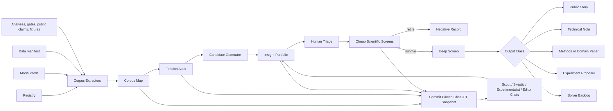

# Puckworks Insight Foundry

## Concept, System Design, Detailed Repository Implementation, and ChatGPT Project Operating Model

**Status:** Proposed implementation blueprint  
**Prepared:** 3 August 2026  
**Primary repository:** `https://github.com/trbrewer/puckworks`  
**Primary purpose:** systematically identify, test, refine, rank, and publish valuable insights already latent in the Puckworks corpus of models, datasets, analyses, negative results, and open scientific questions

---

# Executive summary

Puckworks contains an unusually rich but difficult-to-navigate scientific corpus: registered mechanistic models spanning the espresso process, model cards, typed evidence labels, source datasets, validation results, public claim infrastructure, negative results, experimental needs, and research-radar tooling. The repository is deliberately a component registry rather than a single universal espresso simulation. That is a scientific strength, but it makes discovery of cross-cutting insights difficult because the most valuable questions often live **between** components, datasets, or evidence lineages rather than inside any one card or paper.

The **Puckworks Insight Foundry** is a lightweight, repository-native system for turning that diversity into a repeatable research and communication pipeline.

Its job is not to manufacture papers. Its job is to:

1. map what the repository knows;
2. expose disagreements, equivalences, circularities, hidden discriminators, regime changes, failed compositions, and missing experiments;
3. generate a broad portfolio of candidate insights;
4. falsify weak candidates cheaply;
5. match survivors to the appropriate output level;
6. promote only scientifically promising candidates into expensive publication-grade work.

The Foundry replaces a thesis-first workflow—

> choose a paper thesis, build assurance around it, and only later discover whether the scientific result is compelling

—with a corpus-first workflow—

> generate many evidence-bound questions, run cheap decisive screens, retire most of them, and invest deeply only in survivors.

The system has two complementary operating environments:

- **The repository environment**, used by Codex or Claude Code for deterministic extraction, cross-model execution, candidate generation, testing, plots, and persistent records.
- **A ChatGPT Project**, used for cross-domain synthesis, independent adversarial roles, editorial classification, novelty research, and sustained multi-chat reasoning around a commit-pinned snapshot.

The ChatGPT Project should **not** be filled with every model card as its primary context. Instead, the repository should generate a compact, current, commit-pinned insight snapshot containing the corpus map, tension atlas, candidate portfolio, evidence summary, and the small number of candidate-specific files under active review.

The Foundry should begin as a bounded research-discovery layer. It must not become another large governance programme. Before a candidate survives a cheap scientific viability screen, the required persistent state is only:

- one candidate card;
- one executable screen;
- one result bundle;
- one decision.

Formal protocols, exhaustive literature reviews, publication assurance, and manuscript work begin only after scientific survival.

---

# 1. The problem the Foundry solves

## 1.1 Puckworks has abundant content but weak cross-corpus discoverability

The current repository presents 27 registered models across grind, packing, machine delivery, infiltration, flow, bed dynamics, and extraction. Each component carries typed metadata such as execution role, provenance class, and evidence strength. The model-card template captures scope, governing equations, parameters, source validation, assumptions, interfaces, extractable data, and overlaps or conflicts. The data manifest records dataset lineage, extraction method, units, uncertainty, permitted use, validation strength, and caveats. The public-value layer already generates evidence-bound claims from named producers rather than hand-entered numbers. The research radar searches literature metadata as triage rather than evidence.[1][2][3][4][5][6]

These systems answer questions such as:

- What does this model represent?
- What dataset supports it?
- What is its evidence strength?
- What are its assumptions?
- Can it be run?
- What public claim has already been generated from it?

They do not systematically answer:

- Which models predict the same observable under overlapping conditions?
- Where do those models disagree in sign, shape, magnitude, or causal interpretation?
- Which apparently different mechanisms are observationally equivalent?
- Which parameter or closure fails to transfer between sources?
- Which “validation” target is actually derived from the model or fitted curve being tested?
- Which one additional measurement would discriminate among competing explanations?
- Which negative result is itself publishable?
- Which result deserves a public story rather than an academic paper?
- Which candidate should be killed before expensive publication work begins?

The Foundry supplies this missing relationship layer.

## 1.2 A single large LLM prompt is the wrong primary method

A prompt such as:

> Read the entire repository and find all publishable insights.

is useful for brainstorming but poor as a durable scientific process. It suffers from:

- incomplete context retrieval;
- silent omission of less salient cards or datasets;
- stale understanding of the live repository;
- weak source binding;
- inconsistent comparisons across runs;
- no deterministic candidate registry;
- no execution of cheap falsification screens;
- no persistent record of why an idea was rejected;
- pressure to produce coherence even when the corpus is contradictory.

A ChatGPT Project containing all cards is better for semantic discussion, but it still lacks live code execution, current test state, result bundles, source hashes, and deterministic rebuilding.

The recommended design is hybrid:

```text
repository = source of truth, execution, persistence, and evidence
ChatGPT Project = synthesis, adversarial reasoning, editorial judgment, and novelty research
human = scientific taste, priority, risk appetite, and final decisions
```

## 1.3 The Paper 1 lesson

The recent Paper 1 programme produced valuable mathematics, tests, lineage corrections, and negative results. It also demonstrated a process failure: publication-grade assurance repeatedly preceded the decisive scientific screen.

The Foundry therefore adopts a strict sequencing principle:

> **Scientific viability before publication assurance.**

This does not mean abandoning rigor. It means matching rigor to maturity:

| Candidate maturity | Appropriate rigor |
|---|---|
| Raw seed | provenance pointers and a clear question |
| Cheap screen | deterministic code, one figure, one adversarial check |
| Deep screen | sensitivity, alternatives, held-out or cross-source evidence |
| Paper candidate | protocol, literature review, publication assurance, manuscript |
| Public story | generated claim, scope sentence, evidence badge, reproducibility |

---

# 2. Foundry mission, scope, and non-goals

## 2.1 Mission

The Foundry shall create a repeatable process that converts Puckworks’ distributed scientific assets into a ranked portfolio of:

- public science stories;
- interactive explainers;
- data-lineage and reproducibility notes;
- methods papers;
- model-comparison studies;
- experimental-design papers;
- closure-development studies;
- pore-scale and continuum-model papers;
- corpus/data papers;
- domain-science papers;
- explicit negative scientific records.

## 2.2 Primary outputs

The Foundry produces four classes of persistent output:

1. **Corpus products**
   - machine-readable corpus map;
   - observable and parameter index;
   - evidence-lineage graph;
   - tension atlas.

2. **Candidate products**
   - insight candidate cards;
   - portfolio scores;
   - shortlist;
   - retirement reasons.

3. **Scientific screen products**
   - executable cheap screen;
   - result bundle;
   - primary figure;
   - decision record.

4. **Communication products**
   - public claim candidates;
   - technical-note candidates;
   - paper candidates;
   - experimental protocols;
   - ChatGPT Project snapshot bundle.

## 2.3 Non-goals

The Foundry shall not:

- select a universal espresso recipe;
- merge competing models into a consensus simulation;
- auto-upgrade evidence strength;
- infer novelty without external literature review;
- auto-author manuscripts;
- treat an LLM score as a scientific decision;
- turn metadata or research-radar hits into evidence;
- require every candidate to become an academic paper;
- create heavy gate or freeze machinery for unproven candidates;
- silently replace the existing registry, manifest, model cards, public claims, or research radar.

---

# 3. Design principles

## 3.1 Corpus-first, not thesis-first

The system starts from relationships among existing assets and asks what questions emerge. It does not begin by selecting a preferred conclusion.

## 3.2 Tensions are more valuable than summaries

A summary says:

> Model A includes wetting.

A tension record says:

> Models A and B both reproduce the same cup output, but only A predicts a grind-dependent first-drip delay. First-drip time is therefore a candidate discriminator.

The second is a research question.

## 3.3 Most candidates should die cheaply

A healthy Foundry should retire the majority of candidates before deep work.

Target funnel:

```text
50–80 generated seeds
10–15 human-shortlisted candidates
3–5 cheap-screen survivors
1–3 deep-screen survivors
0–2 publication developments
```

A high retirement rate is evidence of useful selection, not failure.

## 3.4 Separate discovery from evidence

The Foundry may use LLMs to suggest:

- candidate relationships;
- alternative explanations;
- possible discriminators;
- public framing;
- literature search terms.

An LLM suggestion is never a finding. A candidate becomes evidence-bearing only through repository-bound calculations, source inspection, or external research.

## 3.5 Preserve evidence labels

The Foundry consumes Puckworks’ existing evidence-strength vocabulary. It must not relabel:

```text
post-fit reconstruction -> independent validation
qualitative capacity -> predictive evidence
source curve reproduction -> physical validation
exploratory synthesis -> established mechanism
```

## 3.6 Public value and academic value are separate axes

A striking public story may have limited academic novelty. A technically important closure study may have little mass-market appeal. The portfolio should preserve both.

## 3.7 One candidate, one decisive question

A cheap screen should answer a narrow question such as:

- Does the sign of the model disagreement survive a source-closure swap?
- Does first-drip timing distinguish the wetting and static-channeling models?
- Does the new mechanism improve held-out prediction?
- Is the apparent validation target derived from a fitted curve?
- Is the result larger than replicate variation?

It should not attempt to write the whole paper.

## 3.8 Generated snapshots, not manual context dumps

The ChatGPT Project receives a generated insight snapshot. It does not rely on a manually curated pile of individual cards that becomes stale.

---

# 4. Relationship to existing Puckworks architecture

The Foundry is an overlay, not a replacement.

## 4.1 Existing source systems

| Existing system | Foundry use |
|---|---|
| `puckworks/registry.py` | model identity, stage, execution role, provenance class, evidence strength |
| `docs/cards/` | mechanisms, equations, assumptions, validity ranges, interfaces, overlaps/conflicts |
| `puckworks/data/MANIFEST.csv` | dataset identity, evidence lineage, uncertainty, caveats, permitted use |
| analysis and result documents | standing scientific verdicts and prior negative results |
| validation gates and tests | implementation state and known failure boundaries |
| `puckworks/public/` | candidate public claims and existing generated stories |
| `docs/PUBLIC_VALUE.md` | communication guardrails and public-story backlog |
| `docs/research/radar_queries.yml` | external literature-search vocabulary |
| `tools/research_radar.py` | metadata discovery after internal viability |
| experimental-data needs | missing measurement opportunities |
| notebooks and figures | existing observables, visual assets, and runnable examples |

## 4.2 Foundry source-of-truth rule

The Foundry never becomes the authority for a model’s physics or a dataset’s evidence class.

It stores references such as:

```json
{
  "entity_id": "model:foster2025.infiltration",
  "authority": "docs/cards/foster2025.md",
  "registry_id": "foster2025.infiltration",
  "source_commit": "<commit>"
}
```

If the card or manifest changes, the Foundry snapshot must regenerate and show a diff.

## 4.3 Dynamic counts

Counts such as number of models, datasets, claims, candidates, or observable links must be generated from the current tree. They must not be hand-maintained in prose.

---

# 5. Conceptual architecture



## 5.1 Major subsystems

### A. Corpus extractors

Read and normalize:

- registry records;
- model cards;
- manifest rows;
- public claims;
- standing analyses;
- result bundles;
- gate metadata;
- experimental needs;
- research-radar couplings.

### B. Corpus map

A machine-readable graph of entities and relationships.

### C. Tension atlas

A structured list of potentially productive scientific tensions.

### D. Candidate portfolio

A persistent set of insight cards with scores, status, and screen history.

### E. Screen runner

A thin convention for candidate-specific code, results, and decisions.

### F. Snapshot exporter

Builds the small file pack used by the ChatGPT Project.

### G. ChatGPT Project

Runs independent reasoning roles against the same commit-pinned snapshot.

---

# 6. Repository layout

Recommended initial structure:

```text
docs/insights/
  README.md
  INSIGHT_FOUNDRY_DESIGN.md
  INSIGHT_PORTFOLIO.md
  RETIRED_CANDIDATES.md
  generated/
    INSIGHT_SNAPSHOT.md
    corpus_map.json
    corpus_map.graphml
    tension_atlas.csv
    tension_atlas.md
    observable_index.csv
    closure_index.csv
    evidence_lineage_index.csv
    candidate_portfolio.json
    candidate_portfolio.md
    snapshot_manifest.json
  candidates/
    I-000_TEMPLATE.md
    I-001_first_drip_discriminator.md
    I-002_closure_portability.md
  screens/
    I-001/
      README.md
      result.json
      decision.md
      figures/
  chatgpt_project/
    PROJECT_INSTRUCTIONS.md
    CHAT_PROMPTS.md
    SOURCE_PACK_README.md

puckworks/insights/
  __init__.py
  schema.py
  extract_registry.py
  extract_cards.py
  extract_manifest.py
  extract_claims.py
  extract_results.py
  build_corpus_map.py
  build_tension_atlas.py
  generate_candidates.py
  score_portfolio.py
  export_snapshot.py
  cli.py

tests/insights/
  test_schema.py
  test_corpus_map.py
  test_tension_atlas.py
  test_candidate_registry.py
  test_snapshot.py

tools/
  insight_foundry.py
```

The first implementation should be smaller than this complete tree. A sensible minimum viable implementation is:

```text
docs/insights/README.md
docs/insights/INSIGHT_PORTFOLIO.md
docs/insights/candidates/I-000_TEMPLATE.md
puckworks/insights/schema.py
puckworks/insights/build_corpus_map.py
puckworks/insights/build_tension_atlas.py
puckworks/insights/export_snapshot.py
tests/insights/
```

---

# 7. Core data model

## 7.1 Entity types

### ModelRecord

```json
{
  "id": "model:foster2025.infiltration",
  "registry_name": "foster2025.infiltration",
  "stage": "infiltration",
  "execution_role": "runtime",
  "provenance_class": "published_port",
  "evidence_strength": "controlled_independent",
  "card_path": "docs/cards/foster2025.md",
  "mechanisms": ["sharp_front_wetting", "unsaturated_infiltration"],
  "inputs": ["pressure_history", "bed_length", "porosity", "permeability"],
  "outputs": ["wetting_front_position", "first_drip_time"],
  "validity_tags": ["fine_grind", "measured_pressure"],
  "assumption_tags": ["sharp_front", "one_dimensional"],
  "source_commit": "<sha>"
}
```

### DatasetRecord

```json
{
  "id": "dataset:schmieder2023/raw_fractions",
  "manifest_id": "schmieder2023/raw_fractions",
  "source_card": "schmieder2023",
  "observables": ["fraction_concentration", "beverage_mass"],
  "validation_strength": "independent_measurement",
  "uncertainty_retained": true,
  "lineage_tags": ["raw_measurement"],
  "caveats": ["single_machine", "grinder_specific"],
  "source_commit": "<sha>"
}
```

### ObservableRecord

```json
{
  "id": "observable:first_drip_time",
  "name": "First-drip time",
  "units": "s",
  "stage": ["machine", "infiltration", "flow"],
  "measured_by": ["dataset:..."],
  "predicted_by": [
    "model:foster2025.infiltration",
    "model:foster2025.machine_mode"
  ]
}
```

### ClosureRecord

```json
{
  "id": "closure:sherwood_pannusch2024",
  "quantity": "Sherwood number",
  "source_model": "model:pannusch2024.closures",
  "inputs": ["temperature", "flow", "particle_radius"],
  "validity_range": "80–98 C; 1–3 mL/s",
  "evidence_strength": "post_fit_reconstruction",
  "portability_risk": "high",
  "consumers": ["model:pannusch2024.solver"]
}
```

### ResultRecord

```json
{
  "id": "result:pv05_model_composition",
  "producer": "puckworks.public.model_composition.pv05_values",
  "result_path": "puckworks/public/data/pv05_model_composition.json",
  "claim_ids": ["PV-05"],
  "models": ["model:...", "model:..."],
  "datasets": ["dataset:..."],
  "badge": "EXPLORATORY_SIMULATION",
  "evidence_strength": "qualitative_capacity",
  "primary_caveat": "rejects one tested composition, not swelling generally"
}
```

### CandidateInsight

```json
{
  "id": "I-001",
  "title": "First-drip delay as a discriminator of incomplete wetting",
  "question": "Can grind-dependent first-drip delay distinguish incomplete wetting from static channeling?",
  "insight_types": ["hidden_discriminator", "experiment_design"],
  "audience_tracks": ["public_story", "domain_paper"],
  "models": [
    "model:foster2025.infiltration",
    "model:brewer2026.streamtube"
  ],
  "datasets": [],
  "observables": ["observable:first_drip_time"],
  "why_surprising": "Both mechanisms can reduce extraction, but they differ in first arrival.",
  "existing_evidence": [],
  "alternatives": ["machine_headspace", "permeability_change"],
  "cheap_test": "Run matched-condition signature atlas and compare first-drip trends.",
  "minimum_figure": "First-drip time versus physical grind metric for competing models.",
  "stop_condition": "Predictions overlap after declared uncertainty.",
  "status": "SEED",
  "scores": {},
  "history": []
}
```

## 7.2 Relationship types

The graph should support:

```text
PREDICTS
MEASURES
USES
CALIBRATED_FROM
VALIDATED_AGAINST
DERIVED_FROM
RECONSTRUCTS
COMPETES_WITH
COMPLEMENTS
SHARES_OBSERVABLE_WITH
SHARES_PARAMETER_WITH
CONTRADICTS
AGREES_WITH
EXTRAPOLATES_BEYOND
CONSUMES_CLOSURE
PRODUCES_CLOSURE
REQUIRES_MEASUREMENT
SUPPORTS_CLAIM
LIMITS_CLAIM
FALSIFIES_CANDIDATE
```

Every relation must carry provenance:

```json
{
  "source_path": "docs/cards/example.md",
  "source_locator": "Overlaps and conflicts",
  "source_commit": "<sha>",
  "extraction_mode": "structured_card_section",
  "confidence": "explicit"
}
```

## 7.3 Confidence classes

The Foundry should distinguish:

```text
explicit
deterministically_inferred
llm_suggested
human_confirmed
scientifically_tested
```

Only `explicit`, `deterministically_inferred`, `human_confirmed`, and `scientifically_tested` relations may drive automated shortlist scoring. `llm_suggested` relations remain hypotheses.

---

# 8. Corpus extraction pipeline

## 8.1 Registry extraction

Use the live registry rather than parsing README tables.

Command concept:

```bash
python -m puckworks.insights extract-registry \
  --out docs/insights/generated/registry.json
```

Extract:

- component name;
- stage;
- execution role;
- provenance class;
- evidence strength;
- paper and DOI;
- assumptions;
- validity range;
- module;
- gate names;
- notes.

## 8.2 Card extraction

Parse the standard headings:

```text
Scope and mechanism
Governing equations
Parameters
Calibration and validation offered by the source
Assumptions and validity range
Interface mapping
Extractable data
Overlaps and conflicts
Implementation estimate
```

The parser should:

1. preserve full section text;
2. extract explicit identifiers and units where possible;
3. retain the raw section hash;
4. flag cards that deviate from the template;
5. never invent a missing relationship.

LLM-assisted extraction may propose tags, but proposals must be stored separately until reviewed.

## 8.3 Manifest extraction

Parse `puckworks/data/MANIFEST.csv` into typed records.

Required normalized fields:

```text
dataset_id
source_card
source_artifact
extraction_method
published_units
registry_units
uncertainty_retained
license_access
gate_use
validation_strength
caveat
```

Additional Foundry tags may be deterministically derived:

```text
raw_measurement
post_fit
digitized
same_campaign
independent
reference_only
restricted
rights_blocked
```

These tags must not replace the original manifest wording.

## 8.4 Public-claim extraction

Read the generated public claim registry and capture:

- claim ID;
- public question;
- headline;
- producer;
- evidence strength;
- badge;
- datasets;
- models;
- caveat;
- reproduction command;
- source commit.

This prevents the Foundry from proposing a “new” public story that already exists.

## 8.5 Analysis and result extraction

Begin with an allowlist of known structured result locations. Do not recursively interpret every Markdown file.

Example allowlist:

```text
docs/ANALYSIS_*.md
docs/P3_hypotheses.md
docs/public/generated/claims.json
docs/figures/**/results.json
docs/paper*_resource/**/*.json
docs/validation/**/*.json
```

Classify results as:

```text
standing_verdict
exploratory_result
formal_validation
public_claim
negative_result
superseded_result
```

## 8.6 Build integrity

The generated snapshot manifest must record:

```json
{
  "repository": "trbrewer/puckworks",
  "commit": "<sha>",
  "generated_at": "<timestamp>",
  "generator_version": 1,
  "inputs": [
    {"path": "puckworks/data/MANIFEST.csv", "sha256": "..."}
  ],
  "outputs": [
    {"path": "docs/insights/generated/corpus_map.json", "sha256": "..."}
  ]
}
```

---

# 9. The tension atlas

The tension atlas is the core discovery product.

Each row should contain:

```text
tension_id
lens
entity_a
entity_b_or_group
shared_domain
shared_observable
difference
evidence_basis
why_it_matters
candidate_discriminator
data_available
cheap_test_possible
llm_summary
human_status
```

## 9.1 Lens A: model disagreement

Trigger when two or more models:

- predict the same observable;
- have overlapping declared validity;
- differ materially in sign, ordering, curvature, timing, or magnitude.

Examples:

```text
flow minimum produced by machine dynamics versus changing-bed physics
first-drip trend under incomplete wetting versus static channeling
permeability response under swelling versus poroelastic deformation
```

Initial deterministic detection:

```python
same_observable
and overlapping_validity_tags
and different_mechanism_tags
```

Numerical disagreement requires standardized scenario execution.

## 9.2 Lens B: observational equivalence

Trigger when different mechanisms produce nearly indistinguishable values for one measured output.

Question generated:

> What additional observable separates them?

Candidate discriminator rank should favor:

- measurable quantities;
- low-cost measurements;
- high predicted separation;
- low sensitivity to nuisance parameters.

## 9.3 Lens C: model-composition failure

Trigger when:

```text
error(base + mechanism) > error(base)
```

or a new coupling introduces:

- nonphysical values;
- parameter compensation;
- loss of transfer;
- boundary-pinned fits.

The public layer already contains one such example. The Foundry should generalize the lens across component combinations.

## 9.4 Lens D: closure portability

Search for closures that are:

- fitted in one source;
- consumed in another model;
- used outside their declared range;
- inconsistent with another source;
- highly influential downstream.

Candidate output:

```text
closure portability audit
source swap sensitivity
dimensionless regime map
new measurement priority
```

## 9.5 Lens E: data-lineage circularity

Trigger on patterns such as:

```text
target derived from fitted curve
validation data used in calibration
same campaign treated as external
digitized model output treated as measurement
```

This lens can produce valuable data notes and protect future validation.

## 9.6 Lens F: regime transition

Identify dimensionless groups or thresholds where model behavior changes:

- Reynolds or Forchheimer importance;
- capillary versus viscous invasion;
- diffusion versus advection;
- swelling versus available pore space;
- extraction timescale versus shot duration.

Candidate question:

> Does the repository contain observations on both sides of the transition?

## 9.7 Lens G: hidden discriminator

For competing models, compute an observable signature matrix:

```text
rows = candidate observables
columns = models
cells = normalized prediction or sensitivity
```

Rank observables by:

```text
between-model separation / within-model uncertainty
```

## 9.8 Lens H: cross-species inconsistency

Search for one model or shared parameter that:

- fits caffeine;
- fails trigonelline;
- behaves differently for 5-CQA;
- requires incompatible inventory or rate assumptions.

This may reveal:

- incorrect shared kinetics;
- species-specific diffusion;
- equilibrium differences;
- inventory mis-specification;
- measurement-lineage differences.

## 9.9 Lens I: scale mismatch

Compare:

```text
pore-scale solver
synthetic RVE
continuum closure
basket-scale prediction
```

Questions:

- What RVE size stabilizes permeability?
- Does porosity alone predict permeability?
- When do fines or clustering invalidate a closure?
- Does a closure remain invariant with resolution?

## 9.10 Lens J: negative result

Search for explicit:

```text
FAIL
does not transfer
worse than baseline
unphysical parameter required
headline retired
indeterminate
```

Negative results can become:

- analysis autopsies;
- model-composition papers;
- data-lineage notes;
- experimental-design motivations.

## 9.11 Lens K: evidence asymmetry

Find high-prominence claims with weak evidence and low-prominence alternatives with stronger evidence.

This lens must not score “interestingness” by citation count alone. It compares:

- evidence class;
- transfer;
- uncertainty;
- source independence;
- model specificity.

## 9.12 Lens L: missing experiment

Generate a measurement request when:

- multiple models remain plausible;
- one observable has high predicted separation;
- no suitable dataset exists;
- acquisition is feasible.

Output should include:

```text
measurement
protocol
minimum sample
control variables
predicted signatures
failure criteria
public participation potential
```

## 9.13 Lens M: public-story extraction

Search for candidates with:

- one surprising contrast;
- a clear visual;
- practical consequence;
- honest scope;
- evidence already sufficient for a public claim.

Use the five public-value modes:

```text
Aha
Wonder
Action
Agency
Trust
```

---

# 10. Candidate generation

## 10.1 Two-stage generation

### Deterministic stage

Rules create candidate seeds from tension rows.

Example:

```python
if tension.lens == "hidden_discriminator" and tension.cheap_test_possible:
    create_candidate(...)
```

### LLM stage

An LLM receives a bounded tension packet and proposes:

- research question;
- surprise;
- alternatives;
- decisive test;
- public and academic versions;
- stop condition.

LLM output must never directly set a candidate to `SURVIVED`.

## 10.2 Candidate card template

```markdown
# I-XXX — Working title

## Question
One falsifiable sentence.

## Insight type
model disagreement | equivalence | closure portability | lineage |
regime transition | negative result | experiment design | public story

## Target audiences
public | practitioner | technical | academic | methods

## Why it may matter
What changes if true?

## Why it may be surprising
What expectation does it challenge?

## Models
Exact registry identifiers.

## Datasets
Exact manifest identifiers.

## Existing evidence
Only current, source-bound evidence.

## Strongest alternative explanation
The explanation most likely to kill the candidate.

## Cheap scientific screen
One bounded calculation or source audit.

## Minimum viable figure
One figure that would make the result legible.

## Decision rule
SURVIVE if...
RETIRE if...
INCONCLUSIVE if...

## Stop condition
What result ends the thread?

## Possible outputs
Public story:
Technical note:
Academic paper:
Experiment proposal:

## External novelty search terms
Run only after internal survival.

## Status
SEED
```

## 10.3 Status lifecycle

```text
SEED
TRIAGED
CHEAP_SCREEN_ACTIVE
FALSIFIED
SURVIVED_CHEAP_SCREEN
DEEP_SCREEN_ACTIVE
PUBLIC_STORY
TECHNICAL_NOTE
PAPER_CANDIDATE
NEEDS_NEW_DATA
SOLVER_BACKLOG
RETIRED
```

Transitions require one-line reasons.

## 10.4 Retirement record

Retired candidates should be preserved because they prevent repeated rediscovery.

```json
{
  "candidate_id": "I-014",
  "retired_at": "<commit>",
  "reason": "effect disappears under raw replicate analysis",
  "result_path": "docs/insights/screens/I-014/result.json",
  "reopen_condition": "new independent dataset with physical particle size"
}
```

---

# 11. Portfolio scoring

## 11.1 Separate score dimensions

Score 0–5:

```text
scientific_importance
surprise_or_tension
evidence_readiness
falsifiability
tractability
generality
novelty_plausibility
public_value
visual_potential
experimental_actionability
```

Penalties 0–5:

```text
lineage_circularity
source_dependence
known_duplicate
unavailable_data
coupling_complexity
claim_inflation_risk
```

## 11.2 Suggested formulas

Academic priority:

```text
academic_score =
  1.5 * scientific_importance
+ 1.2 * surprise_or_tension
+ 1.2 * falsifiability
+ 1.0 * evidence_readiness
+ 1.0 * generality
+ 1.0 * novelty_plausibility
+ 0.8 * tractability
- 1.5 * lineage_circularity
- 1.0 * source_dependence
- 1.0 * unavailable_data
```

Public priority:

```text
public_score =
  1.5 * public_value
+ 1.5 * visual_potential
+ 1.2 * surprise_or_tension
+ 1.0 * practical_consequence
+ 0.8 * evidence_readiness
+ 0.8 * tractability
- 1.2 * claim_inflation_risk
- 1.0 * lineage_circularity
```

Scores are triage aids only.

## 11.3 Portfolio construction

The shortlist should deliberately include:

```text
3 public-story candidates
3 technical/method candidates
3 academic research candidates
1 high-risk/high-reward candidate
```

Avoid selecting ten variants of one extraction-identifiability question.

---

# 12. Science-first screening workflow

## Stage A — broad discovery

Generate 40–80 seeds using all tension lenses.

Budget:

```text
no new physics
no manuscript
no full literature review
no candidate-specific governance
```

## Stage B — human triage

Human questions:

1. Would I care if this were true?
2. Would another researcher care?
3. Can it be falsified?
4. Is a decisive screen possible now?
5. Is there a useful output even if the result is negative?
6. Is the evidence independent enough for the proposed claim?
7. Is it distinct from an existing Puckworks public story or paper?

Select 10–15.

## Stage C — cheap screen

Budget per candidate:

```text
maximum one focused working day
one executable script
one primary figure
one adversarial check
one decision
```

Required files:

```text
docs/insights/screens/I-XXX/result.json
docs/insights/screens/I-XXX/decision.md
docs/insights/screens/I-XXX/figures/primary.png
```

Decision:

```text
SURVIVE
RETIRE
NEEDS_NEW_DATA
```

## Stage D — deep screen

For survivors:

- alternate formulations;
- source and lineage audit;
- uncertainty and sensitivity;
- held-out or cross-source evidence;
- model comparison;
- power or discriminability;
- preliminary novelty search;
- realistic output classification.

## Stage E — output classification

### Public story

Needs:

- one defensible surprise;
- one strong visual;
- scope sentence;
- practical consequence;
- generated evidence-bound claim.

### Technical note

Needs:

- reproducible correction, negative result, lineage issue, or method;
- value to practitioners or modelers;
- no inflated universal claim.

### Methods paper

Needs:

- method general beyond one source;
- systematic comparisons;
- robustness and reusable implementation.

### Domain paper

Needs:

- substantive physical or chemical relationship;
- alternative explanations tested;
- evidence beyond one fitted source where possible.

### Experiment-design paper

Needs:

- competing models;
- discriminating observable;
- experimental protocol;
- uncertainty and failure criteria.

## Stage F — publication development

Only now begin:

- formal protocol;
- comprehensive literature review;
- venue selection;
- publication-grade assurance;
- manuscript structure;
- final figures.

---

# 13. Agent operating model

## 13.1 Codex or Claude Code: repository agent

Responsibilities:

- read authoritative repository instructions;
- build and update the corpus map;
- parse cards and manifest;
- run standardized model scenarios;
- build the tension atlas;
- generate candidate skeletons;
- implement cheap screens;
- create result bundles and figures;
- export the ChatGPT snapshot;
- keep generated artefacts commit-pinned.

Must not:

- decide novelty;
- silently upgrade evidence;
- write a paper before viability;
- infer missing source content;
- choose a preferred result after seeing outputs.

## 13.2 ChatGPT Project: synthesis environment

Responsibilities:

- cross-domain pattern recognition;
- candidate critique;
- strongest alternative explanations;
- experimental discriminator design;
- output-level classification;
- public framing;
- web-based novelty and adjacency research after survival;
- portfolio balancing.

Must not:

- be the repository source of truth;
- rely on memory instead of snapshot files;
- invent unrecorded model capabilities;
- promote a result without executable evidence.

## 13.3 Human scientific director

Responsibilities:

- set priorities;
- recognize what is genuinely interesting;
- select risk level;
- approve screens;
- judge practical and publication value;
- retire attractive but weak ideas;
- commission new experiments;
- decide when publication-grade work is warranted.

## 13.4 Research radar

Use only after a candidate survives internally.

Functions:

- find recent adjacent papers;
- identify methodological precedents;
- test novelty plausibility;
- locate datasets or collaborators;
- refine venue and terminology.

A radar hit is metadata for human review, not evidence.

---

# 14. ChatGPT Project implementation

## 14.1 Create a new Project

Project name:

```text
Puckworks Insight Foundry
```

Choose **project-only memory at project creation**. This keeps the research environment self-contained: chats can use other conversations in the same project, but cannot draw on unrelated chats or personal memories. Project-only memory cannot be retrofitted to an existing project, so create a new one rather than reusing an older Puckworks Project.[7]

For a Pro account, the current file limit is 40 files per Project, with at most 10 files uploaded at once. This is another reason to use a compact generated snapshot rather than every card.[7]

## 14.2 Initial Project source pack

Upload 8–12 generated files, not hundreds of repository files.

Recommended initial pack:

```text
01_INSIGHT_SNAPSHOT.md
02_corpus_map.json
03_tension_atlas.csv
04_candidate_portfolio.md
05_candidate_portfolio.json
06_data_evidence_summary.md
07_model_observable_matrix.csv
08_closure_portability_index.csv
09_public_claim_inventory.md
10_current_top_candidates.md
11_PROJECT_INSTRUCTIONS.md
12_SOURCE_MANIFEST.json
```

Candidate-specific files are added only while active.

The snapshot should include:

- repository commit;
- model and dataset counts;
- generated date;
- source hashes;
- current top candidates;
- recently retired candidates;
- known stale or superseded claims;
- current public stories;
- current paper candidates.

## 14.3 Project instructions

Paste the following into Project settings.

```markdown
You are working inside the Puckworks Insight Foundry.

Purpose:
Identify, challenge, refine, and classify potentially valuable scientific and public insights from
the commit-pinned Puckworks snapshot supplied in this Project.

Authority:
The repository snapshot files are the source of truth. Do not invent model capabilities, dataset
lineage, evidence strength, or results. Clearly label external research and inference.

Core rules:
1. Discovery is not evidence.
2. Prefer tensions, disagreements, equivalences, negative results, and discriminating measurements
   over generic summaries.
3. Preserve all evidence-strength and lineage labels.
4. Do not turn post-fit reconstruction into independent validation.
5. Do not propose manuscript work before a candidate survives a cheap scientific screen.
6. Attempt to kill a candidate before advocating it.
7. Separate public value, technical value, and academic novelty.
8. Give every candidate a decisive cheap test and a stop condition.
9. Cite exact candidate, model, dataset, result, and source identifiers from the supplied snapshot.
10. When the snapshot lacks support, say so.

Default output for a candidate:
- question;
- why it matters;
- why it is surprising;
- supporting evidence;
- strongest alternative explanation;
- data-lineage risks;
- decisive cheap screen;
- minimum viable figure;
- stop condition;
- likely output tier;
- novelty-search terms;
- confidence and unresolved issues.

The Project is not authorized to alter the repository directly. Repository changes are converted into
bounded instructions for Codex or Claude Code.
```

Project instructions apply only inside the Project and override global custom instructions.[7]

## 14.4 Chat architecture

Create separate chats rather than asking one conversation to perform incompatible roles.

### `00 — Control Room`

Purpose:

- snapshot version;
- portfolio state;
- decisions;
- next actions;
- unresolved cross-chat conflicts.

Starter prompt:

```text
Read the project sources. Confirm the repository commit, snapshot date, top ten candidates, and any
source-integrity warnings. Do not generate new candidates. Produce a one-page control-room summary.
```

Save the accepted summary as a Project source. ChatGPT Projects currently allow a useful response to be saved into project sources for reuse.[7]

### `01 — Scout`

Purpose:

- broad candidate generation.

Prompt:

```text
Act as an independent scientific scout. Use all tension-atlas lenses. Generate 30 candidate insights
that are materially distinct. Prefer contradictions, hidden equivalences, regime transitions,
closure portability, data-lineage traps, negative results, and missing discriminating measurements.
Do not rank them yet. Bind every candidate to exact snapshot IDs. Reject generic “study X more”
suggestions.
```

### `02 — Skeptic`

Purpose:

- kill weak ideas.

Prompt:

```text
Act as a hostile but fair referee. Review the candidate portfolio without trying to improve it first.
For each candidate identify circularity, source dependence, alternative explanations, known
literature duplication, weak effect size, unavailable data, non-portability, and claim inflation.
Recommend RETIRE, CHEAP SCREEN, or NEEDS NEW DATA. Explain the fastest falsification route.
```

### `03 — Experimentalist`

Purpose:

- design discriminating measurements and simulations.

Prompt:

```text
For candidates not retired by the Skeptic, identify the minimum observation or simulation that would
separate the competing explanations. Rank proposed observables by predicted model separation,
measurement feasibility, nuisance sensitivity, and cost. Provide a protocol skeleton and failure
criteria.
```

### `04 — Methods and Solver Architect`

Purpose:

- identify reusable methods and model-development opportunities.

Prompt:

```text
Identify candidates whose main contribution is methodological: model composition, closure
portability, pore-to-continuum mapping, evidence-aware comparison, experiment design, or inverse
problem structure. Distinguish a reusable methods paper from a source-specific result.
```

### `05 — Public Editor`

Purpose:

- identify layperson and practitioner outputs.

Prompt:

```text
Classify surviving candidates for public value using Aha, Wonder, Action, Agency, and Trust. For each,
write one evidence-safe headline, one visual concept, one practical implication, and one scope
sentence. Do not soften evidence labels or translate chemistry directly into taste.
```

### `06 — Academic Editor`

Purpose:

- assign publication class.

Prompt:

```text
For each survivor, decide whether it could support a data note, technical note, methods paper,
domain-science paper, experimental-design paper, or no paper. State the minimum evidence still
required. Do not draft an abstract.
```

### `07 — Novelty Research`

Run only for cheap-screen survivors.

Prompt:

```text
Conduct current web research for the precise surviving question. Search for direct prior answers,
adjacent methods, conflicting findings, relevant datasets, and realistic venues. Separate repository
evidence from external literature. Conclude: likely novel, likely incremental, already answered, or
uncertain.
```

Use web search or deep research with citations. Projects support web search and, depending on plan, may support deep research or agent mode.[7]

### `08 — Portfolio Committee`

Purpose:

- integrate independent judgments.

Prompt:

```text
Compare the Scout, Skeptic, Experimentalist, Public Editor, Academic Editor, and Novelty Research
outputs. Preserve disagreements. Select a balanced shortlist of ten candidates: three public, three
technical/method, three academic, and one high-risk/high-reward. State why each displaced the nearest
alternative.
```

### One chat per active candidate

Name:

```text
I-001 — First-drip discriminator
```

Use only candidate-specific sources plus the global snapshot.

## 14.5 Branching chats

When one candidate has competing interpretations, branch the candidate chat rather than overwriting the original reasoning. ChatGPT Projects support branching a conversation while preserving the original thread.[7]

Recommended branches:

```text
Mechanism A interpretation
Mechanism B interpretation
Null-model interpretation
Public framing
Academic framing
```

## 14.6 Project refresh cadence

Refresh the snapshot when:

- model registry changes;
- manifest changes;
- a major result lands;
- a candidate screen completes;
- a candidate is promoted or retired;
- before a portfolio committee meeting.

Recommended cadence:

```text
weekly while active
monthly when dormant
immediately after major scientific changes
```

Refresh process:

```bash
python -m puckworks.insights export-snapshot \
  --out docs/insights/generated/chatgpt_project
```

Upload replacement files. The source manifest must make the new commit unmistakable.

## 14.7 Chat-to-repository return path

A useful ChatGPT result should not remain only in chat.

Convert it into one of:

```text
candidate card patch
cheap-screen implementation brief
experiment protocol brief
retirement reason
novelty report
public-story brief
```

The repository agent then implements or records it.

---

# 15. Snapshot design

## 15.1 `INSIGHT_SNAPSHOT.md`

Suggested structure:

```text
Repository identity
Current scientific state
Model inventory by stage
Dataset inventory by evidence strength
Existing public claims
Standing negative results
Top tensions
Top candidates
Recently retired candidates
Missing measurements
Current external-literature alerts
Snapshot limitations
```

## 15.2 Model–observable matrix

Rows:

```text
registered models
```

Columns:

```text
pressure
flow
first-drip time
wetting front
permeability
porosity
extraction yield
TDS
species concentration
fraction history
cumulative mass
bed deformation
fines distribution
```

Cell values:

```text
predicts
consumes
calibrates
validates
qualitative only
not applicable
```

## 15.3 Closure index

Fields:

```text
closure
source
consuming models
declared validity
current usage range
evidence strength
conflicting source
sensitivity known
portability risk
candidate IDs
```

## 15.4 Evidence-lineage index

Fields:

```text
dataset
raw or derived
fit relationship
same campaign
independent use allowed
known circularity
current claims using it
required caveat
```

---

# 16. Minimum viable implementation plan

## Phase 0 — design acceptance

Deliver:

```text
docs/insights/INSIGHT_FOUNDRY_DESIGN.md
```

Confirm:

- Foundry does not replace existing authorities;
- cheap-screen sequencing;
- candidate schema;
- initial tension lenses;
- ChatGPT snapshot boundary.

## Phase 1 — corpus map

Implement:

```text
registry extractor
manifest extractor
card section parser
public claim extractor
corpus_map.json
```

Acceptance:

- every registry component represented;
- every manifest row represented;
- unresolved card parsing explicitly flagged;
- source paths and commit hashes recorded.

## Phase 2 — tension atlas

Implement initial lenses:

```text
shared-observable model disagreement
data-lineage circularity
closure portability
model-composition failure
multi-species inconsistency
missing discriminator
public-story extraction
```

Acceptance:

- at least 50 tension rows;
- each row source-bound;
- LLM suggestions labelled;
- no automated scientific verdict.

## Phase 3 — candidate generation

Generate 50 candidates.

Human shortlist:

```text
10–15
```

Create persistent cards.

## Phase 4 — ChatGPT Project

Create a new project with project-only memory. Upload the compact source pack and create the role chats.

Acceptance:

- project instructions installed;
- snapshot commit visible;
- role chats produce distinct outputs;
- first portfolio committee shortlist saved as a project source.

## Phase 5 — first cheap screens

Recommended initial three:

1. **Mechanism-discrimination atlas**
   - channeling versus incomplete wetting;
   - first-drip and saturation signatures.

2. **Closure-portability audit**
   - permeability, Sherwood, diffusion, inventory, rheology.

3. **Model-composition challenge**
   - systematically test when added mechanisms improve or worsen held-out observables.

Each returns:

```text
SURVIVE
RETIRE
NEEDS_NEW_DATA
```

## Phase 6 — deep screens

Run only on survivors.

## Phase 7 — output development

Select public, technical, paper, or experimental outputs.

---

# 17. Suggested first candidates

These are seeds, not established results.

## I-001 — First-drip delay as a mechanism discriminator

Question:

> Can grind-dependent first-drip delay distinguish incomplete wetting from static channeling?

Why promising:

- competing mechanisms;
- shared consequence for extraction;
- different first-arrival signatures;
- measurable observable;
- clear public story;
- possible experiment-design paper.

Cheap screen:

- standardized model signature atlas across a physically coherent grind/permeability domain.

## I-002 — When does more physics make prediction worse?

Question:

> Across Puckworks component combinations, which added mechanisms improve held-out observables, and which create compensating error or reduce transfer?

Cheap screen:

- predefined set of base-plus-one-mechanism comparisons;
- same evidence unit and objective;
- no recalibration and recalibration branches.

## I-003 — Closure portability audit

Question:

> Which literature closures remain stable when transferred across Puckworks sources and operating ranges?

Initial closures:

```text
permeability
Sherwood
diffusivity
equilibrium inventory
rheology
retention
```

## I-004 — Machine versus puck identifiability

Question:

> Under what conditions can pump, headspace, and line resistance mimic changing-bed behavior?

## I-005 — Pore-scale RVE and continuum closure

Question:

> How large must a synthetic espresso-puck RVE be before permeability and anisotropy stabilize, and do continuum closures preserve the pore-scale trends?

## I-006 — Multi-species structural consistency

Question:

> Can one hydraulic and transport state explain caffeine, trigonelline, and 5-CQA simultaneously?

## I-007 — Derived validation targets

Question:

> Which current or commonly used espresso “validation” quantities are post-fit derivations, and how does that change model-ranking conclusions?

## I-008 — Grinder dial is not a unit

Question:

> How often do scientific conclusions reverse when grinder settings are converted—or cannot be converted—to physical particle-size descriptors?

## I-009 — Pressure command versus realized pressure

Question:

> In real logged shots, when does the machine deliver the nominal pressure profile, and when does system behavior dominate?

## I-010 — Missing measurement recommender

Question:

> Given the current model-disagreement graph, which single observable would reduce the largest number of unresolved mechanism conflicts?

---

# 18. Testing and quality controls

The Foundry needs structural correctness, not heavy candidate governance.

## 18.1 Required tests

- every corpus entity has a source path and commit;
- every dataset ID resolves to the manifest;
- every model ID resolves to the registry;
- generated relation confidence is valid;
- LLM-proposed relations cannot be marked tested automatically;
- every candidate has a question, cheap test, stop condition, and status;
- every score uses allowed dimensions;
- retired candidates retain a reason;
- snapshot files share one commit;
- source pack remains within Project file limits;
- generated Markdown and JSON agree on candidate counts.

## 18.2 Candidate screen quality

Every cheap screen must include:

```text
primary result
adversarial check
raw or source-level visualization where applicable
effect relative to uncertainty or variation
alternative explanation
decision rule applied without revision
```

## 18.3 No protocol freeze at seed stage

Do not require:

- immutable protocols;
- merge ceremonies;
- claim ledgers;
- exact-head adjudication cycles;
- publication language bans.

Those become appropriate only for a paper candidate.

---

# 19. Failure modes and safeguards

## 19.1 Candidate explosion

Symptom:

- hundreds of vague ideas.

Control:

- one falsifiable sentence;
- one cheap test;
- one stop condition;
- deduplicate by question and evidence unit.

## 19.2 LLM novelty hallucination

Control:

- no novelty claim before web research;
- exact search terms;
- direct-prior-art classification;
- human review.

## 19.3 Rediscovering existing work

Control:

- existing public claims and paper inventory included in the corpus map;
- candidate generator checks overlap before creating a seed.

## 19.4 Publication inflation

Control:

- publication ladder;
- Academic Editor;
- output type chosen after evidence;
- public and paper scores separated.

## 19.5 Circular validation

Control:

- lineage atlas;
- manifest evidence labels;
- explicit `DERIVED_FROM` edges;
- Skeptic review.

## 19.6 Governance re-expansion

Control:

- candidate maturity rules;
- explicit cheap-screen budget;
- no publication assurance before survival;
- quarterly review of Foundry process, not candidate-by-candidate bureaucracy.

## 19.7 Snapshot staleness

Control:

- commit and hashes displayed in every Project source;
- refresh cadence;
- Control Room begins by confirming snapshot identity.

## 19.8 One chat converges too quickly

Control:

- independent role chats;
- Skeptic sees candidate before Scout rationale where practical;
- preserve disagreements;
- branch conversations.

---

# 20. Success metrics

## Discovery health

```text
candidate diversity by lens
candidate diversity by espresso stage
fraction of candidates with cheap tests
fraction with public and academic classifications
```

## Selection health

```text
retirement rate
median time to retirement
number of candidates surviving cheap screen
number requiring new data
```

## Scientific productivity

```text
new executable screens
new cross-model comparisons
new source-lineage corrections
new discriminating experiments
new held-out or cross-source results
```

## Communication productivity

```text
public stories published
technical notes
methods papers
domain papers
experiment protocols
reusable figures
```

## Process health

A warning signal is:

```text
assurance hours before first scientific result
```

The target should be low for seeds and high only after survival.

---

# 21. First 90 days

## Days 1–14

- implement corpus map;
- implement first seven tension lenses;
- export initial snapshot;
- create ChatGPT Project;
- generate 50 seeds.

## Days 15–30

- run independent role reviews;
- select ten candidates;
- complete three cheap screens;
- retire weak candidates.

## Days 31–60

- deep-screen two to four survivors;
- run preliminary novelty research;
- classify outputs;
- draft experimental protocol for any `NEEDS_NEW_DATA` survivor.

## Days 61–90

- publish at least one public or technical output;
- select at most one or two publication developments;
- begin formal publication process only for those survivors;
- review lens coverage and candidate diversity.

---

# 22. Immediate repository task

The next repository implementation should be bounded to the Foundry foundation.

Suggested branch:

```text
feat/insight-foundry-foundation
```

Suggested objective:

```text
Create the machine-readable corpus map, initial tension atlas, candidate-card schema, portfolio, and
ChatGPT snapshot exporter. Generate but do not scientifically adjudicate the first 50 candidates.
```

Required terminal output:

```text
INSIGHT_FOUNDRY_FOUNDATION_PR_OPEN
```

with:

- branch and PR;
- head/tree;
- generated counts;
- source paths and hashes;
- initial tension-lens coverage;
- candidate count and distribution;
- snapshot pack;
- tests;
- confirmation no existing evidence label or model verdict changed.

---

# 23. Final recommendation

The Puckworks Insight Foundry should be implemented as a small scientific-discovery operating system, not as a new paper programme and not as a general-purpose knowledge-management project.

Its strategic value lies in five shifts:

1. from documents to relationships;
2. from summaries to tensions;
3. from one preferred thesis to a diversified candidate portfolio;
4. from publication assurance before results to cheap scientific falsification first;
5. from one LLM conversation to a persistent repository plus a multi-role ChatGPT Project.

Puckworks’ distinctive asset is not any single model. It is the coexistence of competing models, typed evidence, negative results, source-lineage detail, runnable components, public claim infrastructure, pore-scale and continuum approaches, and explicit missing experiments.

The Foundry makes that coexistence searchable, testable, and productive.

---

# Appendix A — compact candidate JSON schema

```json
{
  "schema_version": 1,
  "id": "I-001",
  "title": "First-drip delay as a discriminator",
  "question": "Can grind-dependent first-drip delay distinguish incomplete wetting from static channeling?",
  "status": "SEED",
  "insight_types": ["hidden_discriminator", "experiment_design"],
  "audience_tracks": ["public_story", "domain_paper"],
  "entities": {
    "models": [],
    "datasets": [],
    "observables": [],
    "closures": []
  },
  "rationale": {
    "importance": "",
    "surprise": "",
    "existing_evidence": [],
    "alternative_explanations": [],
    "lineage_risks": []
  },
  "screen": {
    "question": "",
    "method": "",
    "primary_metric": "",
    "adversarial_check": "",
    "minimum_figure": "",
    "survive_if": "",
    "retire_if": "",
    "inconclusive_if": ""
  },
  "scores": {
    "academic": null,
    "public": null,
    "dimensions": {}
  },
  "history": [],
  "source_commit": ""
}
```

---

# Appendix B — compact tension CSV schema

```text
tension_id
lens
entity_ids
shared_observable
shared_domain
difference_type
difference_summary
source_paths
relation_confidence
evidence_strength
candidate_discriminator
data_available
cheap_test_possible
candidate_id
human_status
source_commit
```

---

# Appendix C — standard cheap-screen decision document

```markdown
# I-XXX Cheap Screen Decision

## Question

## Evidence unit

## Method

## Result

## Primary figure

## Adversarial check

## Strongest alternative explanation

## Decision
SURVIVE | RETIRE | NEEDS_NEW_DATA

## Why

## Claim ceiling

## Next action

## Reproduction

## Source commit
```

---

# Appendix D — source basis

This design is grounded in the current Puckworks architecture:

- the repository’s component-registry approach and current model inventory;[1]
- the model-card template’s explicit `Overlaps and conflicts` section;[2]
- the dataset manifest’s validation-strength and caveat fields;[3]
- the registry’s typed execution role, provenance class, and evidence-strength axes;[4]
- the generated public-claim layer and its producer/evidence integrity rules;[5]
- the research radar’s explicit status as metadata triage rather than evidence;[6]
- the existing public-value roadmap’s focus on disagreements, negative results, null models, and mechanism-separating experiments.[8]

The ChatGPT Project operating model reflects current official Project capabilities: project files and instructions, built-in project memory, project-only memory selected at creation, reusable saved responses as project sources, branching chats, web search, and current plan-dependent file limits.[7]

[1]: https://github.com/trbrewer/puckworks
[2]: https://github.com/trbrewer/puckworks/blob/main/docs/cards/TEMPLATE.md
[3]: https://github.com/trbrewer/puckworks/blob/main/puckworks/data/MANIFEST.csv
[4]: https://github.com/trbrewer/puckworks/blob/main/puckworks/registry.py
[5]: https://github.com/trbrewer/puckworks/blob/main/docs/public/README.md
[6]: https://github.com/trbrewer/puckworks/blob/main/docs/research/radar_queries.yml
[7]: https://help.openai.com/en/articles/10169521-projects-in-chatgpt
[8]: https://github.com/trbrewer/puckworks/blob/main/docs/PUBLIC_VALUE.md
