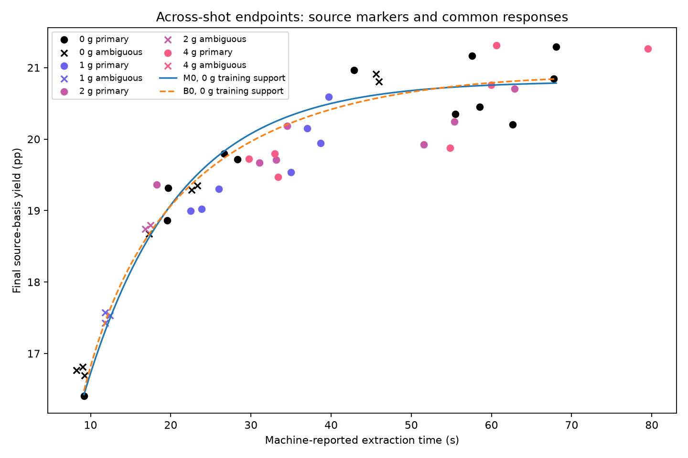
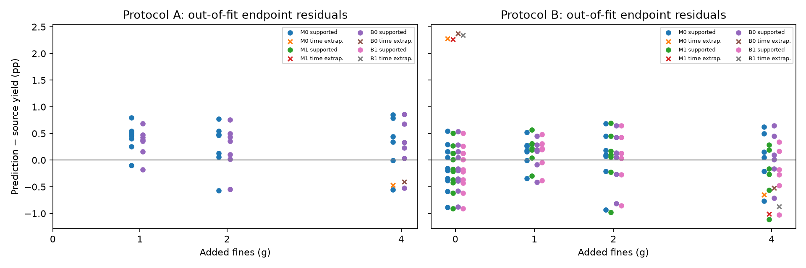
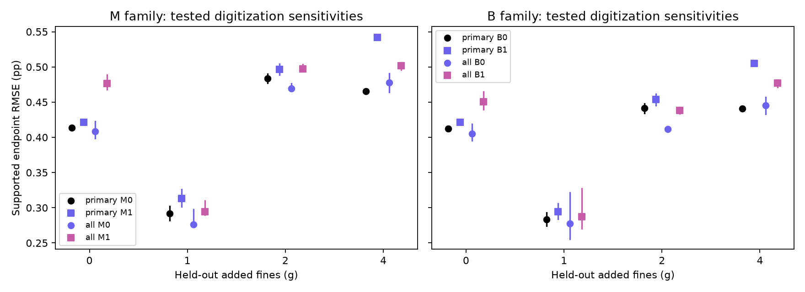

# SCI-MD-SMRKE-TRANSFER-001 result

**COMMON_TIME_RESPONSE: TESTED_COMMON_MODELS_INADEQUATE.**
**FINES_COVARIATE_INCREMENT: NO_MATERIAL_GAIN_FOR_TESTED_CORRECTIONS.**

Neither zero-fines-trained common response meets every arm budget. Neither tested fines correction earns material grouped out-of-fit gain; both worsen central errors, including both interior intervention folds. These conclusions persist through all 18 source treatments and the tighter calculation. Reject these tested response forms for the declared adequacy target; do not add the tested fines term. No specific missing mechanism follows and no successor is automatically authorized.

This is an endpoint-response comparison across different source plotted positions, using public previously inspected data. It is not an in-shot trajectory, protected holdout, independent second validation experiment, causal direct fines effect, or EWP physical validation. No full-data refit was performed.

## Source support and exclusions

| Added fines (g) | Historical estimates | Primary eligible | Ambiguity exclusions | A supported / eligible | B supported / eligible |
|---|---:|---:|---:|---:|---:|
| 0 | 20 | 12 | 8 | training only | 11/12 |
| 1 | 10 | 7 | 3 | 7/7 | 7/7 |
| 2 | 9 | 7 | 2 | 7/7 | 7/7 |
| 4 | 7 | 7 | 0 | 6/7 | 6/7 |

Primary rule: single-marker blob and empty note. All-marker sensitivity retains every historical estimate with its labels. These are **33 primary / 46 all-marker estimates**, not verified independent raw shots. Nominal methods imply 45 shots; visible estimates are not forced into those counts. No CSV correction, hidden observation or inferred shot identity was added.

Primary ambiguity exclusions by CSV line: Fig3:L2, Fig3:L3, Fig3:L4, Fig3:L12, Fig3:L13, Fig3:L28, Fig3:L29, Fig3:L31, Fig3:L32, Fig3:L35, Fig3:L36, Fig3:L40, Fig3:L41.

| Treatment / protocol / held arm (g) | Training-time range (s) | Supported / eligible | Excluded for time extrapolation |
|---|---|---:|---|
| primary:central / A / 1 | 9.18–68.07 | 7/7 | none |
| primary:central / A / 2 | 9.18–68.07 | 7/7 | none |
| primary:central / A / 4 | 9.18–68.07 | 6/7 | Fig3:L27 |
| primary:central / B / 0 | 18.24–79.52 | 11/12 | Fig3:L30 |
| primary:central / B / 1 | 9.18–79.52 | 7/7 | none |
| primary:central / B / 2 | 9.18–79.52 | 7/7 | none |
| primary:central / B / 4 | 9.18–68.07 | 6/7 | Fig3:L27 |
| all:central / A / 1 | 8.24–68.07 | 10/10 | none |
| all:central / A / 2 | 8.24–68.07 | 9/9 | none |
| all:central / A / 4 | 8.24–68.07 | 6/7 | Fig3:L27 |
| all:central / B / 0 | 11.81–79.52 | 16/20 | Fig3:L28, Fig3:L29, Fig3:L30, Fig3:L31 |
| all:central / B / 1 | 8.24–79.52 | 10/10 | none |
| all:central / B / 2 | 8.24–79.52 | 9/9 | none |
| all:central / B / 4 | 8.24–68.07 | 6/7 | Fig3:L27 |

The 4 g marker at 79.52 s is an extrapolation diagnostic in both protocols, never part of a primary metric. In B, holding out 0 g or 4 g extrapolates the intervention input for correction models, independently of time support. The 1 g/2 g interior folds are the principal correction checks. Every treatment retains sufficient declared support; [support.json](support.json) lists every perturbed mask.

## Protocol A: no-added-fines transfer

Error units are yield percentage points; signed error = prediction minus source observation. Budgets: RMSE ≤0.50 and |signed mean| ≤0.25 **in each supported arm**. The proposed budgets are development thresholds, not source sampling uncertainty or the historical S-B gate.

| Treatment | Model | Arm (g) | n | RMSE | MAE | Signed mean | Max absolute | Adequate arm? |
|---|---|---:|---:|---:|---:|---:|---:|---|
| primary:central | M0 | 1 | 7 | 0.4867 | 0.4411 | +0.4136 | 0.7954 | no |
| primary:central | M0 | 2 | 7 | 0.4906 | 0.4319 | +0.2696 | 0.7709 | no |
| primary:central | M0 | 4 | 6 | 0.5726 | 0.4963 | +0.3112 | 0.8502 | no |
| primary:central | B0 | 1 | 7 | 0.4161 | 0.3810 | +0.3293 | 0.6896 | no |
| primary:central | B0 | 2 | 7 | 0.4542 | 0.3877 | +0.2327 | 0.7607 | yes |
| primary:central | B0 | 4 | 6 | 0.5221 | 0.4421 | +0.2691 | 0.8586 | no |
| all:central | M0 | 1 | 10 | 0.3864 | 0.3174 | +0.2810 | 0.7657 | no |
| all:central | M0 | 2 | 9 | 0.4419 | 0.3726 | +0.1805 | 0.8062 | yes |
| all:central | M0 | 4 | 6 | 0.5584 | 0.4834 | +0.3182 | 0.8952 | no |
| all:central | B0 | 1 | 10 | 0.3705 | 0.3259 | +0.2886 | 0.6833 | no |
| all:central | B0 | 2 | 9 | 0.3970 | 0.3088 | +0.1865 | 0.7722 | yes |
| all:central | B0 | 4 | 6 | 0.5208 | 0.4433 | +0.2812 | 0.8773 | no |

In the primary treatment, M0 misses the bias budget in all three arms and the RMSE budget in 4 g. B0 misses the bias budget at 1 g and 4 g and the RMSE budget at 4 g. The 4 g time-extrapolation residual is −0.4659 pp (M0) or −0.4012 pp (B0); these diagnostics do not repair the supported failures.

All primary A predictions, observed yields and individual residuals appear in [PRIMARY_PREDICTIONS.md](PRIMARY_PREDICTIONS.md). The complete labeled primary/all/perturbed/precision records are in [predictions.json](predictions.json) and [residuals.json](residuals.json).

## Protocol B: matched parent/correction comparisons

| Treatment | Held arm (g) | n | M0 RMSE | M1 RMSE | M1 − M0 | B0 RMSE | B1 RMSE | B1 − B0 |
|---|---:|---:|---:|---:|---:|---:|---:|---:|
| primary:central | 0 | 11 | 0.4133 | 0.4216 | +0.0083 | 0.4123 | 0.4212 | +0.0089 |
| primary:central | 1 | 7 | 0.2916 | 0.3133 | +0.0217 | 0.2833 | 0.2946 | +0.0113 |
| primary:central | 2 | 7 | 0.4836 | 0.4966 | +0.0130 | 0.4413 | 0.4535 | +0.0123 |
| primary:central | 4 | 6 | 0.4652 | 0.5421 | +0.0769 | 0.4407 | 0.5052 | +0.0645 |
| all:central | 0 | 16 | 0.4083 | 0.4766 | +0.0682 | 0.4050 | 0.4503 | +0.0454 |
| all:central | 1 | 10 | 0.2764 | 0.2945 | +0.0181 | 0.2774 | 0.2873 | +0.0099 |
| all:central | 2 | 9 | 0.4694 | 0.4972 | +0.0278 | 0.4117 | 0.4384 | +0.0267 |
| all:central | 4 | 6 | 0.4775 | 0.5015 | +0.0240 | 0.4452 | 0.4771 | +0.0319 |

| Treatment | Family | Parent balanced RMSE | Correction balanced RMSE | Gain (pp) | Gain (%) | Material? |
|---|---|---:|---:|---:|---:|---|
| primary:central | M | 0.4202 | 0.4518 | -0.0316 | -7.52 | no |
| primary:central | B | 0.3998 | 0.4258 | -0.0260 | -6.51 | no |
| all:central | M | 0.4158 | 0.4507 | -0.0349 | -8.40 | no |
| all:central | B | 0.3901 | 0.4199 | -0.0298 | -7.64 | no |

Balanced RMSE is sqrt(mean arm MSE), with identical time-supported observations for each pair. Both interior folds worsen in both central treatments. Neither family passes the ≥20% and ≥0.10 pp gain thresholds. No scored primary arm worsens by >0.10 pp, but that condition alone cannot earn gain. This negative gain result is limited to these two additive correction forms and these comparisons: it is neither equivalence nor proof of no fines effect or a purely hydraulic mechanism.

## Tested digitization sensitivities

Central, four global coordinate corners and four position-dependent corners are evaluated separately for primary and all-marker treatments. Isolated allowances are ±0.09 s/±0.011 pp (one calibrated image pixel plus rounding); ambiguous centers use ±0.30 s/±0.05 pp with genuine blob/occlusion dependence retained. These finite ranges are **tested digitization sensitivities**, not confidence intervals, experimental standard errors or exhaustive uncertainty bounds.

| Inclusion | Family | B gain range (pp) | B gain range (%) | Material in any treatment? |
|---|---|---:|---:|---|
| primary | M | -0.0330 to -0.0302 | -7.80 to -7.23 | no |
| primary | B | -0.0271 to -0.0249 | -6.74 to -6.27 | no |
| all | M | -0.0370 to -0.0325 | -8.96 to -7.64 | no |
| all | B | -0.0325 to -0.0267 | -8.28 to -6.77 | no |

| Inclusion | A model / arm (g) | RMSE range (pp) | Signed-mean range (pp) |
|---|---|---:|---:|
| primary | M0 / 1 | 0.4773–0.4967 | +0.4059 to +0.4212 |
| primary | M0 / 2 | 0.4833–0.4982 | +0.2622 to +0.2770 |
| primary | M0 / 4 | 0.5684–0.5774 | +0.2972 to +0.3251 |
| primary | B0 / 1 | 0.4048–0.4278 | +0.3202 to +0.3383 |
| primary | B0 / 2 | 0.4459–0.4627 | +0.2243 to +0.2411 |
| primary | B0 / 4 | 0.5170–0.5277 | +0.2544 to +0.2836 |
| all | M0 / 1 | 0.3751–0.4205 | +0.2534 to +0.3035 |
| all | M0 / 2 | 0.4339–0.4562 | +0.1740 to +0.1870 |
| all | M0 / 4 | 0.5402–0.5775 | +0.3034 to +0.3323 |
| all | B0 / 1 | 0.3609–0.3879 | +0.2609 to +0.3111 |
| all | B0 / 2 | 0.3904–0.4114 | +0.1790 to +0.1938 |
| all | B0 / 4 | 0.4993–0.5449 | +0.2626 to +0.3005 |

Every treatment rejects complete common-model adequacy for both models and rejects material gain for both corrections. Some individual arm budget crossings change across treatments; the two overall scientific dispositions do not. Full precision and extrapolation metrics, including B MAE/bias/max-error for every arm, are in [metrics.json](metrics.json).

## Fitting, parameter interpretation and numerical stability

All **648 distinct fits** converged (72 A fits reused across arms, 576 B fits), spanning 18 treatments × two calculation precisions. No optimizer failure, rescue fit, parameter clipping, tau-bound hit or post-score retuning occurred. The prediction artifact repeats A fit records per arm and therefore contains 792 fit records; these are not 792 independent optimizations.

| Central treatment | A model | Parameters in the declared equations |
|---|---|---|
| primary:central | M0 | 20.811664, 9.632251, 11.669013 |
| primary:central | B0 | 2.8883295, 8.2051101, -0.93622321 |
| all:central | M0 | 20.90674, 8.2183503, 13.412381 |
| all:central | B0 | 4.9202587, 7.0734571, -0.77917154 |

M parameters are (E_inf, A, tau); B parameters are (b0, b1, b2). Correction fits append beta/gamma (pp per unit replacement fraction). All fold parameters, training row identities and constraint diagnostics are retained in predictions.json.

Primary A B0 activates the nondecreasing-at-80-s constraint; M A is interior. Across all stored fit records, 62 have active constraints, all in the B family; repeated A records are included in that count. No M parameter boundary is active. The maximum weighted, internally scaled Jacobian condition is about 389; no numerical rank deficiency was found by the declared diagnostic.

Parameter sensitivity remains scientifically important: in the B-protocol held-0-g fold, primary M0 has (E_inf, tau) ≈(24.813, 130.978 s), while all-marker M0 has ≈(21.040, 22.005 s). Removing ambiguous low-time markers changes the curvature information available to that fold. Primary early-time extrapolation at 9.18 s errs by +2.283 pp for M0 and +2.373 pp for B0. These are not physical diffusion-time estimates. Finite profile diagnostics do not establish statistical parameter identification or exhaustive uniqueness, even when supported predictions are numerically stable.

The tighter 129-point profile / stricter solver calculation changes any reported error metric by at most **7.45013122e-06 pp**, versus the frozen 0.01 pp limit, and changes neither verdict. Maximum tested near-optimum profile prediction spread is 0.005729 pp over the declared diagnostic grid; this is a finite search diagnostic, not a confidence interval.

## Prediction chronology, identities, verification and reproduction

Puckworks source/base: `e786b7846a19da8fae4f02b52b8a2dbbf8b8abee`, tree `fa3ae8b0066066afd42944a9a4bc58f2d4411d51`. EWP base: `6a001b54834522554d13b244e5a5509764f15355`, tree `c15973f9111db4c41f88cacfdde4dddce45d28cb`. Both predecessor merge identities and ancestry were verified.

Independent reviewed candidate: `4419c342940be7f9921ebefc169f233a52437729`, tree `abf4e8c6c04047ec18b588209eaacdba5c0eafb1`. [AUDIT.json](AUDIT.json) is the actual separate-agent receipt. The first candidate and its endpoint-only gain finding remain in Git history; the correction was audited before any real fit or score.

Prediction commit **`67f329b`** was created before invoking the separate scorer. Prediction SHA256: `28e739ac1b164893d21f35d489809b55d13700069f69274d86adbc21b0e56859`. FREEZE SHA256: `b01c7a89161611ff62f7f7ba0436119d40d97c13f9b48972434cf81db3309587`. No predictions or frozen scientific files were changed after scoring. [RESULT_IDENTITIES.json](RESULT_IDENTITIES.json) binds compact results and figures without self-reference; the PR records the actual result/candidate commit.

Executed with Python 3.12.3, NumPy 2.5.3, SciPy 1.18.1 and OPENBLAS_NUM_THREADS=1. The [README commands](README.md) reproduce prepare → fit-predict → score in a new output directory; set OPENBLAS_NUM_THREADS=1 and use these dependency versions for the recorded environment. The CLI saves predictions and their receipt before scoring; exclusive writes preserve previous attempts. Plotting evaluates already frozen functions for display only; those curve points are not extra validation observations.

Focused tests: **36 PASS**, independently repeated by the reviewer; full-tree Ruff PASS; registry gates **65 PASS / 1 historical acknowledged exception**. The initial synthetic B1 decreasing-response conditioning failure (29 pass/1 fail) was fixed algebraically before freeze; its log and history are preserved. Repository-wide tests and hosted CI are tracked separately on [Puckworks PR #268](https://github.com/trbrewer/puckworks/pull/268); their live passed/pending/failed state is not inferred from this scientific result. EWP handoff uses issue #173.

Only supported zero-fines-trained common functions are drawn. Source markers outside that support remain visible; ambiguity crosses do not denote verified raw replicates.

Circles are time-supported; crosses are time extrapolation. Intervention extrapolation at held 0/4 g is a separate qualification.

Finite tested digitization ranges; no statistical uncertainty or physical mechanism interpretation.

PHYSICAL_VALIDATION_OF_EWP=NOT_ESTABLISHED
SMRKE_CROSS_SETUP_S_B=UNCHANGED
PRODUCTION_DEFAULTS_AND_LOCK=UNCHANGED
NO_SUCCESSOR_EXECUTION_AUTHORIZED

Native integrations/builds: **0/0**. Production files/registry/gates/defaults/lock: unchanged. No protected-gate reopening, physical-data commissioning, author contact, merge or successor execution. PRs remain OPEN/UNMERGED.
