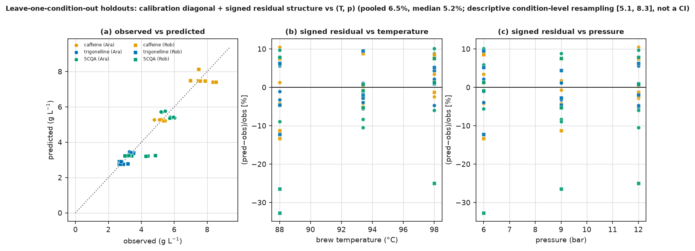
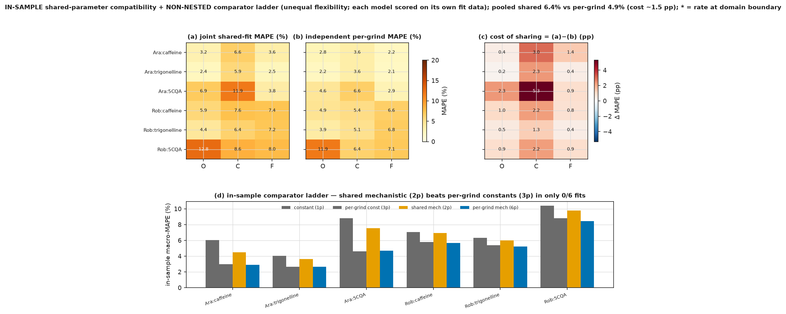
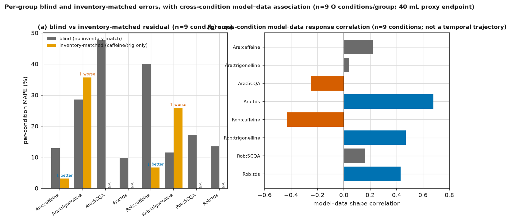
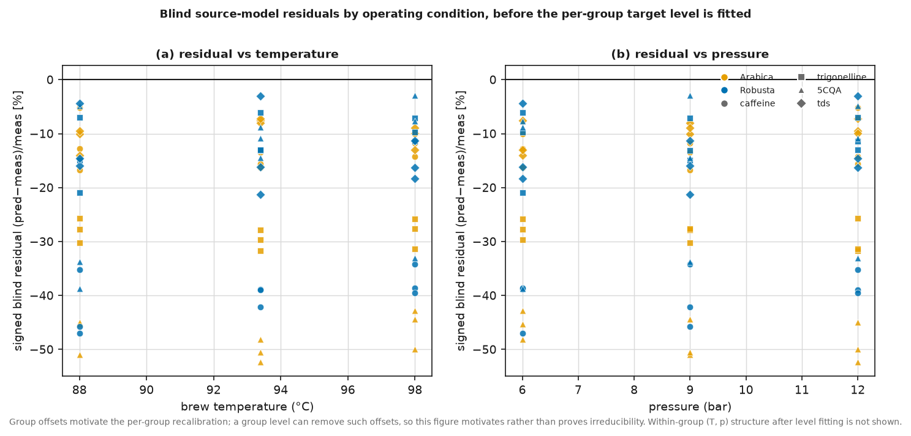

# Supplementary material

<!-- Generated from the archived result records. Do not edit by hand. -->

**Separating Extractable Content from Extraction Rate in Espresso Models: Limits of Whole-Cup Measurements and the Value of Time-Resolved Data**

Every item here is cited by the main text. Items are numbered sequentially within each type: Supplementary Methods S1–S2, Supplementary Note S1, Supplementary Tables S1–S5 and Supplementary Figures S1–S4.

---

### Supplementary Methods S1

**Identifiability definitions and construction of the objective family.**

*Structural* identifiability asks whether parameters are uniquely determined by noise-free,
continuously observed data under a given observation map. It is a property of the model and the
observation map alone, decided analytically, and it is not what this paper measures.

*Practical* identifiability asks whether the parameters are localized by the data actually
available: a finite design, finite noise, a chosen objective and a bounded parameter domain. A
model can be structurally identifiable and practically non-identifiable, which is the situation
studied here. Because a practical statement is conditional on all four of those, every such claim
in this paper is scoped to the tested model, observation map, parameter domain and objective, and
the formal term is used only as shorthand for that scoped statement.

The near-optimal sets reported throughout are *declared threshold sets* on a profiled objective,
not confidence regions: no explicit likelihood or noise model is specified, so no calibrated
coverage is claimed. Where a set reaches the boundary of the tested rate domain it is reported as
censored, because its width is then a property of the domain rather than of the data.

The compensation studied here is the two-parameter case of the broader phenomenon of sloppiness, in
which model behaviour depends on a few stiff parameter combinations while remaining nearly
invariant along many sloppy ones. Sloppiness and practical non-identifiability are related but not
equivalent; the profile is reported directly rather than inferring localization from eigenvalue
spectra.

**The objective family.** The rate multiplier is profiled on a 29-point geometric
grid spanning 0.15–6.5. At each grid point the solid-inventory level is the exact least-squares
minimizer given the rate, so the profile is a one-dimensional section through the exact joint
minimum rather than an alternating search. Three objectives are evaluated at every grid point:

1. *Unweighted concentration-scale sum of squares*, the primary objective.
2. *Relative L2*, which divides each residual by its observation, so every observation contributes
   equally in proportional terms and small concentrations are not down-weighted.
3. *Huber*, with 1.345 * 1.4826 * MAD of the residuals at the SSE optimum (95%-efficiency tuning), per panel. This limits the influence of large residuals without
   discarding them.

A near-optimal set at threshold t is the set of profiled grid points whose objective lies within a
factor (1 + t) of the profiled minimum. Thresholds of 2, 5, 10 and 20 % are reported so that the
headline 10 % figure can be seen as one point in a monotone family rather than a chosen cut.

---

### Supplementary Methods S2

**Endpoint-proxy and external-trajectory processing.**

*Endpoint proxy.* The source campaign reports beverage mass, not volume, and the model integrates
to a volume. A fixed beverage volume is therefore used as the endpoint proxy at which model and
measurement are compared. Because that proxy is a modelling choice rather than a measured quantity,
every reported analysis is repeated at 38, 40 and 42 mL. This is a sensitivity analysis of the
proxy choice; it is not propagation of a measured mass uncertainty, and the spread across the three
endpoints should not be read as an uncertainty interval on any measurement.

Two distinct estimands are reported at the three endpoints, and they are kept apart deliberately.
The first is the blind discrepancy of the source model at the optimal grind, which measures how far
an uncalibrated prediction sits from the measurement. The second is the complete transfer benchmark
of Supplementary Table S3: fit inventory and rate on the nine optimal-grind conditions at the
endpoint, freeze the calibration, predict every held-out coarse and fine observation at the same
endpoint, refit the level-only comparator at the same endpoint, and repeat the paired clustered
resampling. An endpoint-induced shift common to both predictors cancels in the model-minus-null
contrast even when it materially moves the blind residual, so a single reported sensitivity would
be misleading for one estimand or the other.

Estimand of the transfer benchmark: pooled held-out MAPE of the frozen optimal-grind mechanistic calibration MINUS that of the optimal-grind-trained level-only constant, both evaluated at the same endpoint proxy, over all held-out coarse/fine points

*External trajectory.* The external dissolved-solids series is a time-resolved trajectory measured
on different equipment from the primary campaign, at 93.0 °C and 9.0 bar.
It is used as a shape stress test, not as rate validation. Three processing choices are each swept
because none is determined by the published record: the time offset between the machine's start
signal and the first collected fraction; whether the first fraction is retained or dropped, since
it is the one most affected by that offset; and the loss used to score the fit. Rates swept:
0.25, 0.4, 0.6, 0.8, 1.0, 1.4, 2.0, 3.0, 4.0.

Two losses are reported because they weight the trajectory differently. *Profiled MAPE* weights
every fraction by the reciprocal of its observation, so the small early dissolved-solids bins
dominate it. *nRMSE* is the root-mean-square residual after a least-squares level, expressed as a
percentage of the mean observation, so bins are weighted by absolute residual instead. The full
sensitivity is Supplementary Table S4.

---

### Supplementary Note S1

**Dimensional audit of the orthogonal same-campaign inventory assay.**

This is the audit the main text refers to when it states that the assay and the model's fitted
inventory are not demonstrably commensurate. The intersection of the measured dry-coffee assay with
the profiled inventory curve equates two quantities in mg mL⁻¹ whose physical volume bases are not
shown to match, and the assay's basis alone is ambiguous by roughly a factor of three — far larger
than the ±10 % perturbation that was propagated. The valley passing near an independently measured
inventory of the same order of magnitude is a real and useful *qualitative* result; the specific
implied rate is not a secure quantitative constraint.

#### The two quantities being equated

| Quantity | Source | Value (caffeine) | Stated units | Provenance |
|---|---|---|---|---|
| `pannusch2024` `c_s0` | fitted to Schmieder fractions | **10.80** | mg mL⁻¹ | **fitted** — volume basis not independently stated; cup conc. is exactly linear in `c_s0` via the solver normalisation `cl1`, so its absolute scale is entangled with the fit |
| Angeloni Table 7 `C₀^s` | R&G dry-coffee assay | **12 540 mg L⁻¹ → 12.54 mg mL⁻¹** | `mg/L (= mg/kg, 1 kg = 1 L assumed)` | **measured** dry-coffee assay in mg kg⁻¹, reinterpreted as mg L⁻¹ under ρ = 1 g mL⁻¹ |

The reported intersection numeric conversion is arithmetically correct; the **basis identification** is the unverified step.

#### The conversion, from first principles

The assay is *mass of solute per mass of dry roast-and-ground coffee* (mg kg⁻¹). To compare it with a
model solid-phase concentration *per unit volume* (mg mL⁻¹) requires a density/volume basis:

    C_vol [mg mL⁻¹] = assay [mg kg⁻¹] · ρ [kg L⁻¹] / 1000        (per unit volume of coffee, density ρ)

or, on a per-bed-volume basis,

    C_bed [mg mL⁻¹] = assay [mg kg⁻¹] · m_dose [kg] / V_bed [mL]

The `1 kg = 1 L` assumption is exactly the choice **ρ = 1.0 g mL⁻¹** — a value that matches neither
the bulk density of R&G coffee nor its roasted-particle (skeletal) density.

#### Basis-sensitivity of the caffeine Table 7 value

Using assay = 12 540 mg kg⁻¹, dose = 20 g, and the Angeloni bed geometry R = 29.25 mm, H = 13.88 mm
(⇒ V_bed = πR²H = 37.3 cm³), ε_O = 0.305 (⇒ solid volume V_bed·(1−ε) = 25.9 cm³):

| Basis | ρ or volume | caffeine `c_s0` [mg mL⁻¹] |
|---|---|---|
| **`1 kg = 1 L` (assumed)** | ρ = 1.0 g mL⁻¹ | **12.54** |
| roasted-particle / skeletal density | ρ ≈ 1.3 g mL⁻¹ | ~16.3 |
| R&G bulk density | ρ ≈ 0.38 g mL⁻¹ | ~4.8 |
| per mL of **bulk bed** | 20 g ÷ 37.3 mL | ~6.7 |
| per mL of **solid phase** | 20 g ÷ 25.9 mL | ~9.7 |

Defensible bases span roughly **4.8–16.3 mg mL⁻¹ (≈ 3.4×)**. The typical densities used above are
order-of-magnitude literature values for roasted coffee (bulk ≈ 0.30–0.45 g cm⁻³; particle/skeletal
≈ 1.2–1.4 g cm⁻³); the conclusion does **not** depend on their exact values — even the narrowest
plausible pair (bulk 0.38 vs the assumed 1.0) already differs by ~2.6×, i.e. ≫ the ±10 % propagated.

#### Why the numeric rate is not secure

The intersection reads the rate where `c*(rate) = C₀^s`. Sliding `C₀^s` across 4.8–16.3 mg mL⁻¹
moves the intersection far along the profiled valley — well outside the reported 0.60–1.76 band, and
potentially off the tested rate domain — so **"rate ≈ 0.95" is an artefact of the ρ = 1.0 choice**,
not a measured constraint. Compounding this, `pannusch2024`'s `c_s0` is itself **fitted** with an
unanchored volume basis, so even the *correct* physical basis for the assay is not known to coincide
with the model's. The near-agreement of the two numbers (10.80 vs 12.54) is suggestive but, given the
~3.4× basis ambiguity, cannot carry quantitative weight.

#### What survives (the qualitative claim)

An independently measured solid inventory of the **same order of magnitude** as the profiled valley
is consistent with the valley and demonstrates the *design lesson*: an orthogonal inventory
measurement **could** break the inventory–rate compensation that the beverage endpoint alone cannot.
That is the defensible, useful statement — and it is unchanged by the unit-basis problem. What is not
defensible is presenting Table 7 as a numerical tie-breaker that fixes the rate at ≈ 0.95.

---

### Supplementary Table S1

**Fitted parameters and boundary flags for every solute × variety panel.**

The rate multiplier is profiled over 0.15–6.5 on a 29-point geometric grid under the primary
unweighted sum-of-squares objective; the solid-inventory level at each rate is the exact
least-squares minimizer. "Minimum on boundary" flags a panel whose profiled optimum sits at an edge
of the tested domain, in which case the point estimate is a property of the domain. The 10 %
near-optimal range is likewise censored where it reaches an edge.

| variety | solute | conditions | rate at minimum | minimum on boundary | 10 % near-optimal range | range censored |
|---|---|---:|---:|---|---|---|
| Arabica | caffeine | 9 | 0.659 | no | 0.385–6.500 | upper |
| Arabica | trigonelline | 9 | 3.794 | no | 1.292–6.500 | upper |
| Arabica | 5CQA | 9 | 6.500 | yes | 1.935–6.500 | upper |
| Robusta | caffeine | 9 | 0.196 | no | 0.150–0.440 | lower |
| Robusta | trigonelline | 9 | 0.440 | no | 0.225–2.533 | none |
| Robusta | 5CQA | 9 | 0.150 | yes | 0.150–6.500 | lower, upper |

**Local curvature at the joint optimum.** Computed for the two panels shown in main-text Figure 2,
on natural-log parameters, by central finite differences. The sloppy direction is the unit
eigenvector of the smallest eigenvalue, in (ln rate, ln inventory) coordinates; a direction near
the antidiagonal is the inventory–rate compensation seen directly.

| variety | solute | rate at optimum | inventory level (mg mL⁻¹) | condition number | Hessian eigenvalues | sloppy direction | curvature coupling |
|---|---|---:|---:|---:|---|---|---:|
| Arabica | caffeine | 0.659 | 13.491 | 1.93e+03 | 0.264, 509 | (-0.978, +0.208) | -0.994 |
| Arabica | trigonelline | 3.794 | 5.334 | 3.62e+03 | 0.0585, 212 | (-1.000, +0.026) | -0.839 |

---

### Supplementary Table S2

**The complete objective and threshold family: all six solute × variety panels, three objective
families, four near-optimal thresholds.**

Rate domain 0.15–6.5 on a 29-point geometric grid. The count `k/29` is the number of tested rate
points inside the near-optimal set; the denominator is printed so the fraction cannot be read
without it. Censoring flags record whether the set reaches the tested lower or upper boundary, in
which case its width is a property of the tested domain rather than of the data. Objective
construction is Supplementary Methods S1.

| variety | solute | objective | threshold | points in set | fraction | rate low | rate high | log width | rate at minimum | minimum on boundary | set censored |
|---|---|---|---|---|---|---|---|---|---|---|---|
| Arabica | caffeine | sse | 2 % | 6/29 | 0.207 | 0.504 | 0.987 | 0.673 | 0.659 | no | none |
| Arabica | caffeine | sse | 5 % | 11/29 | 0.379 | 0.440 | 1.692 | 1.346 | 0.659 | no | none |
| Arabica | caffeine | sse | 10 % | 22/29 | 0.759 | 0.385 | 6.500 | 2.827 | 0.659 | no | upper |
| Arabica | caffeine | sse | 20 % | 23/29 | 0.793 | 0.336 | 6.500 | 2.961 | 0.659 | no | upper |
| Arabica | caffeine | relative_l2 | 2 % | 5/29 | 0.172 | 0.504 | 0.863 | 0.538 | 0.576 | no | none |
| Arabica | caffeine | relative_l2 | 5 % | 8/29 | 0.276 | 0.440 | 1.130 | 0.942 | 0.576 | no | none |
| Arabica | caffeine | relative_l2 | 10 % | 19/29 | 0.655 | 0.385 | 4.340 | 2.423 | 0.576 | no | none |
| Arabica | caffeine | relative_l2 | 20 % | 24/29 | 0.828 | 0.294 | 6.500 | 3.096 | 0.576 | no | upper |
| Arabica | caffeine | huber | 2 % | 19/29 | 0.655 | 0.576 | 6.500 | 2.423 | 0.863 | no | upper |
| Arabica | caffeine | huber | 5 % | 20/29 | 0.690 | 0.504 | 6.500 | 2.557 | 0.863 | no | upper |
| Arabica | caffeine | huber | 10 % | 21/29 | 0.724 | 0.440 | 6.500 | 2.692 | 0.863 | no | upper |
| Arabica | caffeine | huber | 20 % | 23/29 | 0.793 | 0.336 | 6.500 | 2.961 | 0.863 | no | upper |
| Arabica | trigonelline | sse | 2 % | 9/29 | 0.310 | 2.214 | 6.500 | 1.077 | 3.794 | no | upper |
| Arabica | trigonelline | sse | 5 % | 11/29 | 0.379 | 1.692 | 6.500 | 1.346 | 3.794 | no | upper |
| Arabica | trigonelline | sse | 10 % | 13/29 | 0.448 | 1.292 | 6.500 | 1.615 | 3.794 | no | upper |
| Arabica | trigonelline | sse | 20 % | 15/29 | 0.517 | 0.987 | 6.500 | 1.884 | 3.794 | no | upper |
| Arabica | trigonelline | relative_l2 | 2 % | 10/29 | 0.345 | 1.935 | 6.500 | 1.211 | 3.316 | no | upper |
| Arabica | trigonelline | relative_l2 | 5 % | 12/29 | 0.414 | 1.479 | 6.500 | 1.481 | 3.316 | no | upper |
| Arabica | trigonelline | relative_l2 | 10 % | 14/29 | 0.483 | 1.130 | 6.500 | 1.750 | 3.316 | no | upper |
| Arabica | trigonelline | relative_l2 | 20 % | 16/29 | 0.552 | 0.863 | 6.500 | 2.019 | 3.316 | no | upper |
| Arabica | trigonelline | huber | 2 % | 8/29 | 0.276 | 2.533 | 6.500 | 0.942 | 6.500 | yes | upper |
| Arabica | trigonelline | huber | 5 % | 10/29 | 0.345 | 1.935 | 6.500 | 1.211 | 6.500 | yes | upper |
| Arabica | trigonelline | huber | 10 % | 13/29 | 0.448 | 1.292 | 6.500 | 1.615 | 6.500 | yes | upper |
| Arabica | trigonelline | huber | 20 % | 15/29 | 0.517 | 0.987 | 6.500 | 1.884 | 6.500 | yes | upper |
| Arabica | 5CQA | sse | 2 % | 3/29 | 0.103 | 4.966 | 6.500 | 0.269 | 6.500 | yes | upper |
| Arabica | 5CQA | sse | 5 % | 6/29 | 0.207 | 3.316 | 6.500 | 0.673 | 6.500 | yes | upper |
| Arabica | 5CQA | sse | 10 % | 10/29 | 0.345 | 1.935 | 6.500 | 1.211 | 6.500 | yes | upper |
| Arabica | 5CQA | sse | 20 % | 14/29 | 0.483 | 1.130 | 6.500 | 1.750 | 6.500 | yes | upper |
| Arabica | 5CQA | relative_l2 | 2 % | 4/29 | 0.138 | 4.340 | 6.500 | 0.404 | 6.500 | yes | upper |
| Arabica | 5CQA | relative_l2 | 5 % | 7/29 | 0.241 | 2.898 | 6.500 | 0.808 | 6.500 | yes | upper |
| Arabica | 5CQA | relative_l2 | 10 % | 10/29 | 0.345 | 1.935 | 6.500 | 1.211 | 6.500 | yes | upper |
| Arabica | 5CQA | relative_l2 | 20 % | 15/29 | 0.517 | 0.987 | 6.500 | 1.884 | 6.500 | yes | upper |
| Arabica | 5CQA | huber | 2 % | 3/29 | 0.103 | 4.966 | 6.500 | 0.269 | 6.500 | yes | upper |
| Arabica | 5CQA | huber | 5 % | 6/29 | 0.207 | 3.316 | 6.500 | 0.673 | 6.500 | yes | upper |
| Arabica | 5CQA | huber | 10 % | 10/29 | 0.345 | 1.935 | 6.500 | 1.211 | 6.500 | yes | upper |
| Arabica | 5CQA | huber | 20 % | 14/29 | 0.483 | 1.130 | 6.500 | 1.750 | 6.500 | yes | upper |
| Robusta | caffeine | sse | 2 % | 6/29 | 0.207 | 0.150 | 0.294 | 0.673 | 0.196 | no | lower |
| Robusta | caffeine | sse | 5 % | 7/29 | 0.241 | 0.150 | 0.336 | 0.808 | 0.196 | no | lower |
| Robusta | caffeine | sse | 10 % | 9/29 | 0.310 | 0.150 | 0.440 | 1.077 | 0.196 | no | lower |
| Robusta | caffeine | sse | 20 % | 18/29 | 0.621 | 0.150 | 6.500 | 3.769 | 0.196 | no | lower, upper |
| Robusta | caffeine | relative_l2 | 2 % | 6/29 | 0.207 | 0.150 | 0.294 | 0.673 | 0.225 | no | lower |
| Robusta | caffeine | relative_l2 | 5 % | 8/29 | 0.276 | 0.150 | 0.385 | 0.942 | 0.225 | no | lower |
| Robusta | caffeine | relative_l2 | 10 % | 10/29 | 0.345 | 0.150 | 0.504 | 1.211 | 0.225 | no | lower |
| Robusta | caffeine | relative_l2 | 20 % | 23/29 | 0.793 | 0.150 | 6.500 | 3.769 | 0.225 | no | lower, upper |
| Robusta | caffeine | huber | 2 % | 6/29 | 0.207 | 0.150 | 0.294 | 0.673 | 0.196 | no | lower |
| Robusta | caffeine | huber | 5 % | 7/29 | 0.241 | 0.150 | 0.336 | 0.808 | 0.196 | no | lower |
| Robusta | caffeine | huber | 10 % | 9/29 | 0.310 | 0.150 | 0.440 | 1.077 | 0.196 | no | lower |
| Robusta | caffeine | huber | 20 % | 18/29 | 0.621 | 0.150 | 6.500 | 3.769 | 0.196 | no | lower, upper |
| Robusta | trigonelline | sse | 2 % | 6/29 | 0.207 | 0.336 | 0.659 | 0.673 | 0.440 | no | none |
| Robusta | trigonelline | sse | 5 % | 11/29 | 0.379 | 0.294 | 1.130 | 1.346 | 0.440 | no | none |
| Robusta | trigonelline | sse | 10 % | 19/29 | 0.655 | 0.225 | 2.533 | 2.423 | 0.440 | no | none |
| Robusta | trigonelline | sse | 20 % | 29/29 | 1.000 | 0.150 | 6.500 | 3.769 | 0.440 | no | lower, upper |
| Robusta | trigonelline | relative_l2 | 2 % | 8/29 | 0.276 | 0.440 | 1.130 | 0.942 | 0.576 | no | none |
| Robusta | trigonelline | relative_l2 | 5 % | 15/29 | 0.517 | 0.336 | 2.214 | 1.884 | 0.576 | no | none |
| Robusta | trigonelline | relative_l2 | 10 % | 24/29 | 0.828 | 0.294 | 6.500 | 3.096 | 0.576 | no | upper |
| Robusta | trigonelline | relative_l2 | 20 % | 27/29 | 0.931 | 0.196 | 6.500 | 3.500 | 0.576 | no | upper |
| Robusta | trigonelline | huber | 2 % | 8/29 | 0.276 | 0.336 | 0.863 | 0.942 | 0.504 | no | none |
| Robusta | trigonelline | huber | 5 % | 15/29 | 0.517 | 0.294 | 1.935 | 1.884 | 0.504 | no | none |
| Robusta | trigonelline | huber | 10 % | 26/29 | 0.897 | 0.225 | 6.500 | 3.365 | 0.504 | no | upper |
| Robusta | trigonelline | huber | 20 % | 29/29 | 1.000 | 0.150 | 6.500 | 3.769 | 0.504 | no | lower, upper |
| Robusta | 5CQA | sse | 2 % | 12/29 | 0.414 | 0.150 | 0.659 | 1.481 | 0.150 | yes | lower |
| Robusta | 5CQA | sse | 5 % | 29/29 | 1.000 | 0.150 | 6.500 | 3.769 | 0.150 | yes | lower, upper |
| Robusta | 5CQA | sse | 10 % | 29/29 | 1.000 | 0.150 | 6.500 | 3.769 | 0.150 | yes | lower, upper |
| Robusta | 5CQA | sse | 20 % | 29/29 | 1.000 | 0.150 | 6.500 | 3.769 | 0.150 | yes | lower, upper |
| Robusta | 5CQA | relative_l2 | 2 % | 29/29 | 1.000 | 0.150 | 6.500 | 3.769 | 0.440 | no | lower, upper |
| Robusta | 5CQA | relative_l2 | 5 % | 29/29 | 1.000 | 0.150 | 6.500 | 3.769 | 0.440 | no | lower, upper |
| Robusta | 5CQA | relative_l2 | 10 % | 29/29 | 1.000 | 0.150 | 6.500 | 3.769 | 0.440 | no | lower, upper |
| Robusta | 5CQA | relative_l2 | 20 % | 29/29 | 1.000 | 0.150 | 6.500 | 3.769 | 0.440 | no | lower, upper |
| Robusta | 5CQA | huber | 2 % | 29/29 | 1.000 | 0.150 | 6.500 | 3.769 | 0.336 | no | lower, upper |
| Robusta | 5CQA | huber | 5 % | 29/29 | 1.000 | 0.150 | 6.500 | 3.769 | 0.336 | no | lower, upper |
| Robusta | 5CQA | huber | 10 % | 29/29 | 1.000 | 0.150 | 6.500 | 3.769 | 0.336 | no | lower, upper |
| Robusta | 5CQA | huber | 20 % | 29/29 | 1.000 | 0.150 | 6.500 | 3.769 | 0.336 | no | lower, upper |

**Reading.** The objective minimum is interior in 13 of 18 panel × objective cells, so
the interior minimum of the illustrative Arabica-caffeine panel is *not* a universal feature. The
10 % near-optimal set reaches a tested boundary in 16 of 18 cells. The breadth of the
near-optimal set is therefore robust to the objective, while the location of the point minimum is
not.

---

### Supplementary Table S3

**Endpoint propagation: the complete transfer-versus-null benchmark at 38, 40 and 42 mL.**

For each endpoint proxy the whole procedure is repeated — fit inventory and rate on the nine
optimal-grind conditions at that endpoint, freeze the calibration, predict all held-out coarse and
fine observations at the same endpoint, refit the optimal-grind-trained level-only constant at the
same endpoint, and repeat the primary clustered resampling of the paired loss. Processing is
described in Supplementary Methods S2.

| endpoint | model pooled MAPE (%) | level-only null (%) | paired difference (pp) | primary range, conditions within group (pp) | primary range excludes zero | secondary range, whole groups (pp) | model worse on | skill vs null |
|---|---:|---:|---:|---:|---|---:|---:|---:|
| 38 mL | 8.17 | 8.59 | -0.421 | [-0.79, -0.03] | excludes 0 | [-0.82, -0.07] | 51 of 108 | 0.049 |
| 40 mL | 8.23 | 8.59 | -0.361 | [-0.72, +0.03] | includes 0 | [-0.75, -0.03] | 50 of 108 | 0.042 |
| 42 mL | 8.20 | 8.59 | -0.392 | [-0.78, +0.01] | includes 0 | [-0.77, -0.04] | 49 of 108 | 0.046 |

**Per group.** Macro MAPE for each variety × solute group at each endpoint.

| endpoint | group | model macro MAPE (%) | null macro MAPE (%) | difference (pp) |
|---|---|---:|---:|---:|
| 38 mL | Arabica:5CQA | 11.57 | 12.82 | -1.25 |
| 38 mL | Arabica:caffeine | 6.76 | 7.57 | -0.81 |
| 38 mL | Arabica:trigonelline | 4.92 | 4.96 | -0.04 |
| 38 mL | Robusta:5CQA | 9.46 | 9.81 | -0.35 |
| 38 mL | Robusta:caffeine | 8.49 | 8.41 | +0.08 |
| 38 mL | Robusta:trigonelline | 7.79 | 7.96 | -0.17 |
| 40 mL | Arabica:5CQA | 11.62 | 12.82 | -1.20 |
| 40 mL | Arabica:caffeine | 6.93 | 7.57 | -0.64 |
| 40 mL | Arabica:trigonelline | 5.01 | 4.96 | +0.05 |
| 40 mL | Robusta:5CQA | 9.51 | 9.81 | -0.30 |
| 40 mL | Robusta:caffeine | 8.49 | 8.41 | +0.08 |
| 40 mL | Robusta:trigonelline | 7.82 | 7.96 | -0.14 |
| 42 mL | Arabica:5CQA | 11.73 | 12.82 | -1.09 |
| 42 mL | Arabica:caffeine | 6.62 | 7.57 | -0.95 |
| 42 mL | Arabica:trigonelline | 4.96 | 4.96 | +0.00 |
| 42 mL | Robusta:5CQA | 9.55 | 9.81 | -0.26 |
| 42 mL | Robusta:caffeine | 8.49 | 8.41 | +0.08 |
| 42 mL | Robusta:trigonelline | 7.84 | 7.96 | -0.12 |

**Reading.** The effect size is stable: −0.36 to −0.42 pp across 38, 40 and 42 mL, a spread of 0.06 pp. That is an order of magnitude smaller than the ≈ 5 pp movement in the blind optimal-grind residual over the same endpoints, which is what one expects when both predictors are re-derived at each endpoint so that a shift common to both cancels. The sign never changes and the model remains worse on roughly half the held-out points (49–51 of 108) at every endpoint. The inferential reading, however, is not endpoint-invariant: at 38 mL the primary conditions-within-group clustered percentile range is [−0.79, −0.03], which excludes zero, while at 40 mL ([−0.72, +0.03]) and 42 mL ([−0.78, +0.01]) it includes zero. The conclusion that the advantage is small and unresolved therefore holds at the 40 mL proxy used throughout and at 42 mL, but at 38 mL the range narrowly excludes zero — with an upper bound of −0.03 pp, an advantage of at most a third of a percentage point. This dependence on the proxy is reported as part of the conclusion rather than relegated to a footnote.

The level-only constant's pooled MAPE is 8.59 % at ALL THREE endpoints, and that is a correctness check rather than a coincidence: the constant is fitted to MEASURED concentrations, which do not depend on where the solver terminates. Only the mechanistic predictor moves with the endpoint. If the baseline had moved too, the pipeline would not be doing what this analysis claims.

**Not the same quantity as the blind-residual sweep.** This is NOT the same quantity as `endpoint_mass_sensitivity`, which reports the blind optimal-grind per-condition residual. Both predictors are re-derived at each endpoint here, so a shift common to both cancels -- which is exactly why the ~5 pp movement in the blind residual does not by itself imply that the model-versus-null conclusion is endpoint-dependent.

---

### Supplementary Table S4

**External dissolved-solids trajectory under both losses, for every time-alignment and first-bin
choice.**

Conditions and loss definitions are given in Supplementary Methods S2.

| case | time offset (s) | first bin | min MAPE (%) | best rate (MAPE) | range ratio (MAPE) | min nRMSE (%) | best rate (nRMSE) | range ratio (nRMSE) | cup range ratio |
|---|---|---|---|---|---|---|---|---|---|
| offset0s_all_bins | 0 | included | 30.80 | 0.4 | 1.87 | 56.58 | 0.25 | 1.30 | 1.00 |
| offset0s_no_first_bin | 0 | dropped | 26.81 | 0.4 | 2.07 | 63.27 | 0.25 | 1.29 | 1.00 |
| offset2s_all_bins | 2 | included | 32.32 | 0.4 | 1.80 | 62.84 | 0.25 | 1.23 | 1.00 |
| offset2s_no_first_bin | 2 | dropped | 28.18 | 0.4 | 1.98 | 70.02 | 0.25 | 1.22 | 1.00 |
| offset4s_all_bins | 4 | included | 35.23 | 0.25 | 1.64 | 67.43 | 0.25 | 1.20 | 1.00 |
| offset4s_no_first_bin | 4 | dropped | 31.25 | 0.25 | 1.77 | 74.93 | 0.25 | 1.19 | 1.00 |

**Reading.** Under the absolute-residual loss the rate preference is SHALLOWER (range ratio 1.19-1.30 vs 1.64-2.07 under MAPE), the minimum residual is much larger (57-75 % vs 27-35 %), and the preferred rate moves to 0.25 -- the LOWER BOUNDARY of the swept rate set, so it is censored. The shallow preference reported under MAPE is therefore partly an early-bin percentage-error effect, and the panel supports less than the MAPE-only reporting implied.

The cup range ratio is 1.00 in every case. That is algebraic, not empirical: with one integrated
scalar and one free multiplicative level, the model matches the scalar exactly at every rate.

---

### Supplementary Table S5

**Convergence of the spatial discretisation and the integration tolerance.**

This is convergence of the **spatial discretisation and integration tolerance**, which is a
different quantity from the rate-parameter-grid convergence reported in the main text. It is
included because the paper's temporal-information result depends on the shape of the outlet
trajectory, so the numerics producing that shape are load-bearing.

Numerical scheme: five-point biased-upwind advection on a uniform axial grid; Dirichlet inlet c_l(z=0)=0; stiff BDF integration with a supplied Jacobian sparsity pattern and a numerically estimated Jacobian.

Panel: Arabica:caffeine, granulometry O, 9 conditions.
Deviations are measured against the finest cell tested.

| axial nodes | rel/abs tolerance | whole cup | early | middle | late | rate at minimum | range ratio | dev. cup (%) | dev. late (%) | dev. range ratio (%) |
|---:|---:|---:|---:|---:|---:|---:|---:|---:|---:|---:|
| 100 | 1e-05 | 4.55880 | 7.38355 | 3.98797 | 2.30487 | 0.884 | 1.4268 | 0.0001 | 0.0004 | 0.0011 |
| 100 | 1e-06 | 4.55880 | 7.38352 | 3.98800 | 2.30488 | 0.884 | 1.4269 | 0.0001 | 0.0002 | 0.0016 |
| 100 | 1e-07 | 4.55880 | 7.38352 | 3.98800 | 2.30488 | 0.884 | 1.4268 | 0.0000 | 0.0000 | 0.0001 |
| 200 | 1e-05 | 4.55881 | 7.38358 | 3.98797 | 2.30490 | 0.884 | 1.4265 | 0.0003 | 0.0006 | 0.0204 |
| 200 | 1e-06 | 4.55880 | 7.38352 | 3.98800 | 2.30488 | 0.884 | 1.4268 | 0.0000 | 0.0001 | 0.0004 |
| 200 | 1e-07 | 4.55880 | 7.38352 | 3.98800 | 2.30488 | 0.884 | 1.4268 | 0.0000 | 0.0000 | 0.0001 |
| 400 | 1e-05 | 4.55882 | 7.38346 | 3.98809 | 2.30491 | 0.884 | 1.4266 | 0.0004 | 0.0013 | 0.0174 |
| 400 | 1e-06 | 4.55880 | 7.38353 | 3.98800 | 2.30488 | 0.884 | 1.4268 | 0.0000 | 0.0001 | 0.0009 |
| 400 | 1e-07 | 4.55880 | 7.38352 | 3.98800 | 2.30488 | 0.884 | 1.4268 | 0.0000 | 0.0000 | 0.0000 |

Concentrations are in mg mL⁻¹ on the model's internal basis; deviations are relative to the finest
cell.

**Reading.** The spatial discretisation and integration tolerance are converged at the production configuration by a wide margin. Across three axial resolutions (100, 200 and 400 nodes) × three solver tolerances (1e-5, 1e-6, 1e-7), the whole-cup concentration varies by at most 0.0004 %, the late fraction — the most discretisation-sensitive of the three sub-intervals — by at most 0.0013 %, and the profile range ratio by at most 0.0204 %. The location of the profiled-objective minimum is the same (0.884) in all nine cells. The identifiability conclusion is therefore not an artefact of the numerics: the broad, boundary-reaching near-optimal set is a property of the design and the data, not of the mesh or the integration tolerance. Even 100 axial nodes reproduces the 400-node answer, so the production grid of 200 is already beyond what these outputs require. This is convergence of the discretisation only; it is not evidence about the accuracy of the continuum model itself.

Worst-case relative deviation across all nine cells: whole cup 0.0004 %, late
fraction 0.0013 %, profile range ratio 0.0204 %. The profiled
minimum location is identical in every cell.

**Solver diagnostics.** SciPy emitted six RuntimeWarnings during the sweep (four 'overflow encountered in multiply', two 'invalid value encountered in multiply'; two unique messages), all from `scipy.integrate._ivp.common.num_jac` — the numerical Jacobian estimator. The solver supplies a Jacobian sparsity pattern but not an analytic Jacobian, so SciPy estimates the entries by finite differences, and its step-size heuristic can overflow on the stiffest cells. They are recorded rather than suppressed.

That they do not affect the reported values now rests on evidence independent of cross-cell agreement, which two configurations exercising the same numerical path could satisfy while both were wrong. Across all 1458 profiled solves in the nine cells, every integration terminated successfully, every stored state was finite, the accumulated volume and cumulative mass were monotone, and concentrations stayed physical — the worst interior liquid value was +4.47e-07 and the worst solid value -4.53e-09 (a negligible undershoot of the kind an upwind advection scheme produces, not a failed integration). The inlet node is excluded from the positivity check: it carries the Dirichlet condition, which the right-hand side imposes on a zeroed copy, so the stored value there is unconstrained and physically meaningless. These checks cover the solution at the requested output times, not every internal BDF step.

Re-running the sweep with this instrumentation reproduced every previously archived cell value exactly, so the numbers below are confirmed rather than replaced.

---

### Supplementary Figure S1

**Figure S1. Leave-one-condition-out evaluation within the Angeloni optimal-grind design.** Each fold holds out one of nine temperature–pressure conditions within a coffee-variety × solute group, refits the target inventory and rate multiplier on the remaining eight conditions, and predicts the held-out concentration at the matched 40 mL endpoint. Panel (a) compares observed and predicted concentrations; panels (b) and (c) show signed held-out residuals against temperature and pressure. Across two varieties and three named solutes, the analysis contains 54 held-out predictions. Reported resampling intervals are descriptive condition-level summaries of already-computed folds and do not repeat the nonlinear fit or remove fold dependence. Evidence tier: within-campaign cross-condition holdout, not independent-machine validation.

---

### Supplementary Figure S2

**Figure S2. In-sample compatibility of a shared inventory–rate pair across grinds.** Residuals are shown by coffee variety, solute, and grind after fitting one shared solid-inventory level and one shared Sherwood rate multiplier to all included Angeloni conditions. The comparison reports the cost of sharing against separate per-grind fits and reduced level-only baselines, together with any rate-boundary flag. The shared mechanistic fit reconstructs the pooled data at approximately 6.4% macro-MAPE versus approximately 4.9% for separate per-grind fits; this is an in-sample parameter-sharing penalty, not held-out transfer. Evidence tier: same-campaign compatibility diagnostic.

---

### Supplementary Figure S3

**Figure S3. Per-group blind and inventory-matched residual diagnostics at the optimal grind.** Each variety × observable group contains nine Angeloni temperature–pressure conditions evaluated at the 40 mL proxy endpoint. Panel (a) compares blind source-model MAPE with MAPE after matching the orthogonal same-campaign inventory assay where available; panel (b) reports the model–data correlation across conditions. Inventory matching can improve one analyte and worsen another, so the residual cannot be interpreted as a pure inventory offset. Correlations are descriptive associations across operating conditions, not temporal correlations or held-out skill measures. Evidence tier: within-campaign diagnostic.

---

### Supplementary Figure S4

**Figure S4. Blind source-model residuals versus temperature and pressure before target-level fitting.** Signed residuals, `(prediction − measurement)/measurement`, are plotted for each coffee-variety × solute group across the nine optimal-grind conditions at the matched 40 mL endpoint. Colour denotes variety and marker denotes solute. Group-level offsets motivate a target-specific level recalibration, but the plot does not show whether within-group temperature–pressure structure remains after that level is fitted. No uncertainty interval is implied by point density. Evidence tier: pre-fit source-to-target discrepancy diagnostic.
